## Part 1. Установка ОС
- __Установить Ubuntu 20.04 Server LTS без графического интерфейса.__ 
  - Узнаю версию Ubuntu, выполнив команду
`cat /etc/issue.`

  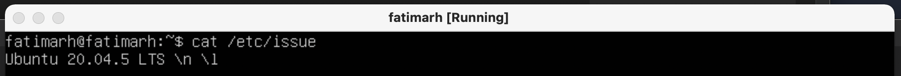
***
## Part 2. Создание пользователя
- __Создать пользователя, отличного от пользователя, который создавался при установке. Пользователь должен быть добавлен в группу adm.__
  - Используя команду ```sudo useradd -G adm user_1 ``` создаю пользователя __user_1__ .
  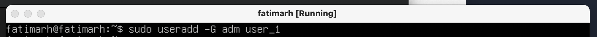
  - Новый пользователь должен быть в выводе команды 
  ``` cat /etc/passwd ```
  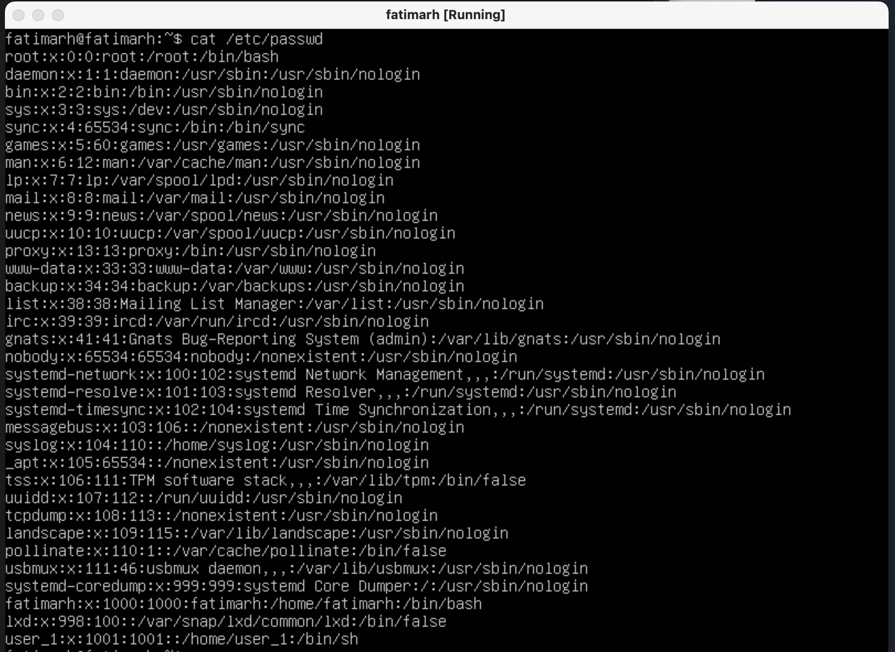
***
## Part 3. Настройка сети ОС
- __Задать название машины вида user-1__
    - используя команду ``` sudo hostnamectl set-hostname user-1 ``` создаю имя машины __user-1__
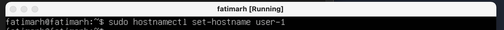
- __Установить временную зону, соответствующую вашему текущему местоположению.__
  1. Используя команду  `sudo timedatectl set-timezone Europe/Moscow` устанавливаю временную зону.
  2. Текущую дату , время и временную зону проверяю с помощью команды `timedatectl`
Так же можно использовать команду `ls -l /etc/localtime` для уточнения
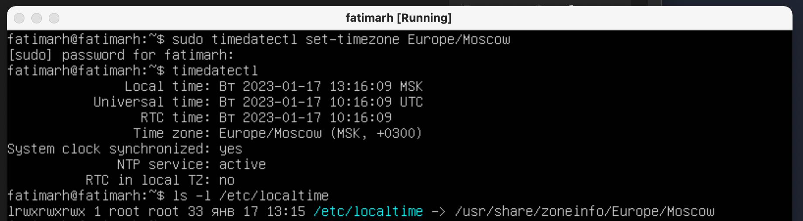
- __Вывести названия сетевых интерфейсов с помощью консольной команды.__
- Oбъяснение наличию интерфейса lo.
  - lo - метод передачи цифровых потоков данных от их источника и обратно к тому же источнику без специальной обработки или модификаций. Имеющий виртуальный интерфейс который ограничен только производительностью системы. Используется как средство межпроцессного обмена информацией только для локальных процессов, как дополнительное средство в исправлении проблем физического соединения.
- для вывода сетевого интерфейса __lo__ использую команду `ip link show`
также можно использовать команды:
  1.`ip addr`
  2.`ip -s link`
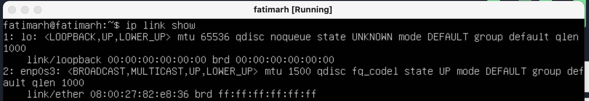
- __Используя консольную команду получить ip адрес устройства, на котором вы работаете, от DHCP сервера.__
- расшифровка DHCP.
  - DHCP (англ. Dynamic Host Configuration Protocol — протокол динамической настройки узла) — протокол прикладного уровня модели TCP/IP, служит для автоматизации назначения IP-адреса клиенту. Он широко используется в современных сетях, позволяющий сетевым устройствам автоматически получать IP-адрес и другие параметры, необходимые для работы в сети TCP/IP. Данный протокол работает по модели «клиент-сервер». Для автоматической конфигурации компьютер-клиент на этапе конфигурации сетевого устройства обращается к так называемому серверу DHCP и получает от него нужные параметры. Сетевой администратор может задать диапазон адресов, распределяемых сервером среди компьютеров. Это позволяет избежать ручной настройки компьютеров сети и уменьшает количество ошибок. Протокол DHCP используется в большинстве сетей TCP/IP.
- исользуя команду `ip a` узнаю __ip адрес__. 
также можно использовать команды `ip add`
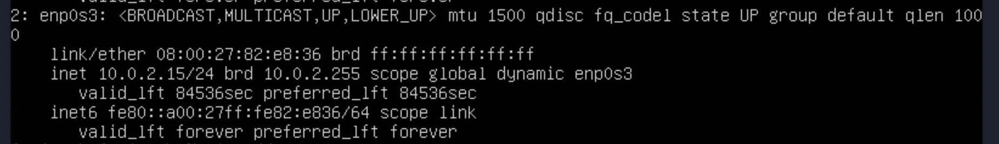
- __Определить и вывести на экран внешний ip-адрес шлюза (ip) и внутренний IP-адрес шлюза, он же ip-адрес по умолчанию (gw).__
- Для этого использую команду `netstat -r -n` и команду `ip route`
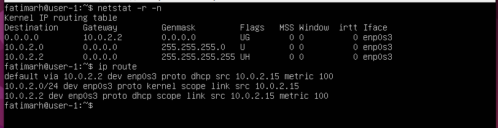
- __Задать статичные (заданные вручную, а не полученные от DHCP сервера) настройки ip, gw, dns (использовать публичный DNS серверы, например 1.1.1.1 или 8.8.8.8).__
- Узнаю адрес шлюза с помощью команды ` ip route show match 0/0`
мой ip адрес шлюза __10.0.2.15__.
В локальных сетях адреса шлюза находятся в следующих диапазонах
  - `10.0.0.0 – 10.255.255.255`
  - `172.16.0.0 – 172.31.255.255`
  - `192.168.0.0 – 192.168.255.255`
В моем случае подходит первый вариант
  - ввожу команду `sudo vim /etc/netplan/00-installer-config.yaml` с помощью редактора __vim__ вношу изменения
  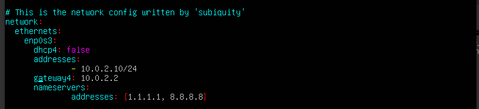
  - сохраняю изсенения с помощью команды `sudo netplan apply`
  перезагружаю командой `sudo reboot` проверяю ip адрес командой `ip a`
  
- __Перезагрузить виртуальную машину. Убедиться, что статичные сетевые настройки (ip, gw, dns) соответствуют заданным в предыдущем пункте.__
  - Перезагружаю командой `sudo reboot` используя команду `cd /etc/netplan` попадаю в директорию __netplan__ использую команду `systemd-resolve --status | grep -i 'DNS Server' -A2` флаг `-i` для игнорирования регистра.
  
  -  Успешно пингую удаленные хосты __1.1.1.1__ и __ya.ru__ с помощью команд `ping 1.1.1.1` и соотвественно `ping ya.ru`
  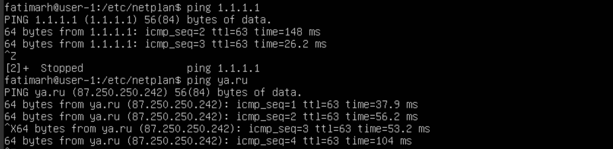
***
## Part 4. Обновление ОС
- __Обновить системные пакеты до последней на момент выполнения задания версии.__
  - Ввожу команду `sudo apt-get update` которая обновит информацию о пакетах, содержащихся в репозиториях.
Затем ввожу команду  `sudo apt-get dist-upgrade` для обновления последней версии.
  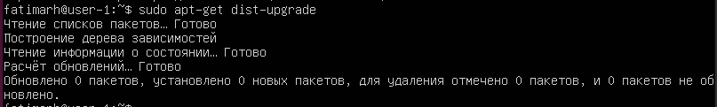
***
## Part 5. Использование команды sudo
- __Разрешить пользователю, созданному в Part 2, выполнять команду sudo.__
- Истинное назначение команды `sudo`
  - __`sudo`__ (англ. Substitute User and do, дословно «подменить пользователя и выполнить») — программа для системного администрирования UNIX-систем, позволяющая делегировать те или иные привилегированные ресурсы пользователям с ведением протокола работы. Основная идея — дать пользователям как можно меньше прав, при этом достаточных для решения поставленных задач. Программа поставляется для большинства UNIX и UNIX-подобных операционных систем.
  Команда sudo предоставляет возможность пользователям выполнять команды от имени суперпользователя `root`, либо других пользователей. Правила, используемые __`sudo`__ для принятия решения о предоставлении доступа, находятся в файле `/etc/sudoers` (для редактирования файла можно использовать специальный редактор __visudo__, запускаемый из командной строки без параметров, в том числе без указания пути к файлу); язык их написания и примеры использования подробно изложены в `man sudoers`.
  В большинстве случаев грамотная настройка __`sudo`__ делает небезопасную работу от имени суперпользователя ненужной. Все действия оказываются выполнимы из-под аккаунта пользователя, которому разрешено использовать __`sudo`__ без ограничений. Имеется возможность запрещать и разрешать определённым пользователям или группам выполнение конкретного набора программ, а также разрешить выполнение определённых программ без необходимости ввода своего пароля.
- Поменять hostname ОС от имени пользователя, созданного в пункте Part 2 (используя sudo).
  - Выполняю перезагрузку командой `sudo reboot` 
  - Создаю нового пользователя командой `sudo adduser test-user`
    Создаю пароль для нового пользователя. Остальные параметры пропускаю с помощью `Enter`.
  - Добавляю пользователя `test-user` в группу __sudo__ командой `sudo usermod -aG test-user`
  - Переключаю пользователя на `test-user` командой `su test-user`
  - Создаю новое имя машины командой ` sudo hostnamectl set-hostname user-2 `
  - Перезагружаю систему командой `sudo reboot`
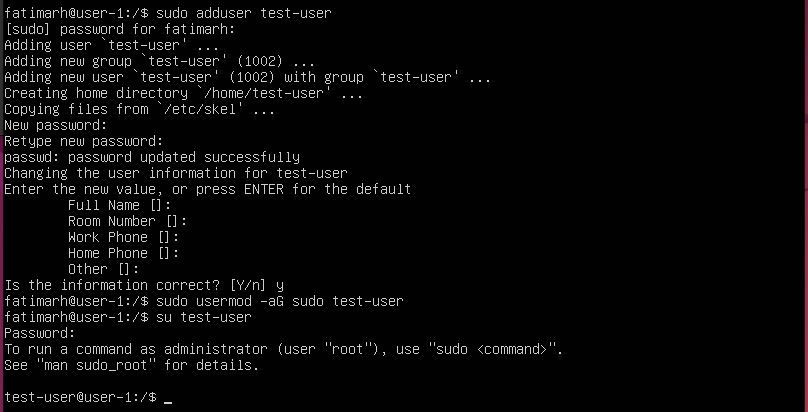
- Вставить скрин с изменённым hostname в отчёт.

---
## Part 6. Установка и настройка службы времени
- __Настроить службу автоматической синхронизации времени.__
  - __NTP__ (Network Time Protocol) — это сетевой протокол для синхронизации системного времени компьютера через сетевое соединение. NTP-клиент запрашивает время у общедоступного NTP-сервера, а затем использует ответ сервера для корректировки локальных часов.
  __Ubuntu__ использует `ntpdate` и `ntpd`.

  - __ntpdate__
  Ubuntu стандартно устанавливается с `ntpdate` и будет запускать его при каждой загрузке один раз для установки времени по NTP серверу Ubuntu.
`ntpdate -s ntp.ubuntu.com`
  - __ntpd__
Сервис NTP ntpd вычисляет уход ваших системных часов и постоянно подправляет их, благодаря чему не происходит сильных изменений, что может приводить к непоследовательности в журналах. Ценой этому небольшое расходование мощности процессора и оперативной памяти, но для современного сервера это несущественно.
  - __Установка__
  Для установки `ntpd` из терминала ввожу команду:
  `sudo apt-get install ntp`
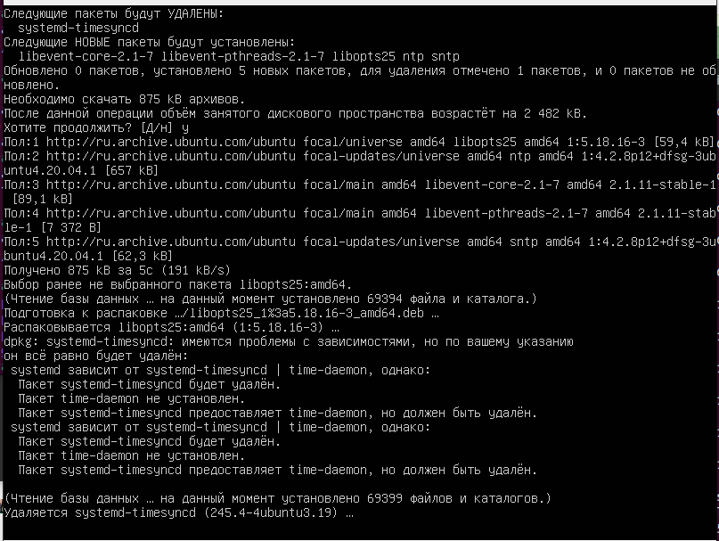
- Вывести время, часового пояса, в котором вы сейчас находитесь.
  Использую команду `date`
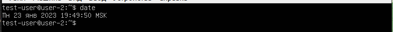
- Вывод следующей команды должен содержать NTPSynchronized=yes: 
timedatectl show.
  - Перезагружаю систему `sudo reboot`
  - Устанавливаю командой `sudo apt-get install ntp`
  - устанавливаю утилиту командой`sudo apt install ntpdate`
  - Команда синхронизаций: `ntpdate -s ntp.ubuntu.com`
  - Открываю конфиг : `sudo nano /etc/systemd/timesyncd.conf  `
  - Изменяю сведения о NTP-сервере :
  ```
  [Time]
  - NTP=ntp.ubuntu.com
  FallbackNTP=ntp.ubuntu.com
  ```
  - Обновляю данные: `sudo systemctl daemon-reload`
  - Команда вывода: `sudo timedatectl show`
  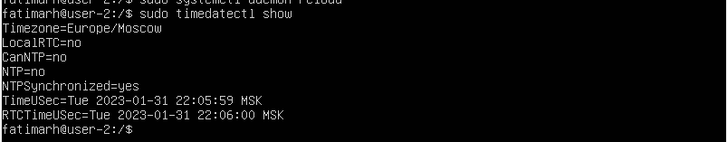
  ---
## Part 7. Установка и использование текстовых редакторов.
- __Установить текстовые редакторы VIM (+ любые два по желанию NANO, MCEDIT, JOE и т.д.)__
  - Устанавливаю редактор MCEDIT командой : `sudo apt install mc`
    - __Используя каждый из трех выбранных редакторов, создайте файл test_X.txt, где X -- название редактора, в котором создан файл. Напишите в нём свой никнейм, закройте   файл с сохранением изменений.__
    - Создаю файл __`test_mcedit.txt`__  с помощью команды `touch test_mcedit.txt`
    - Редактирую содержимое с помощью команды `mcedit test_mcedit.txt` 
    - Прописав никнейм сохраняю содержимое файла сочетанием клавиш __`Fn+F2`__
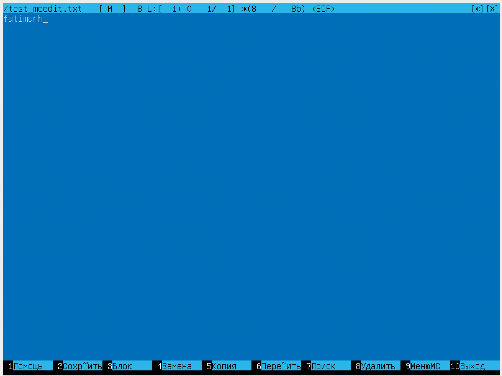
- Создаю файл __`test_vim.txt`__ командой `touch test_vim.txt`
  - Используя команду `vim test_vim.txt` для открытия редактора
  - Нажимаю __`i`__ прописав нинейм нажмаю кнопку __`esc`__ затем прописываю комнаду `:wq` для сохранения
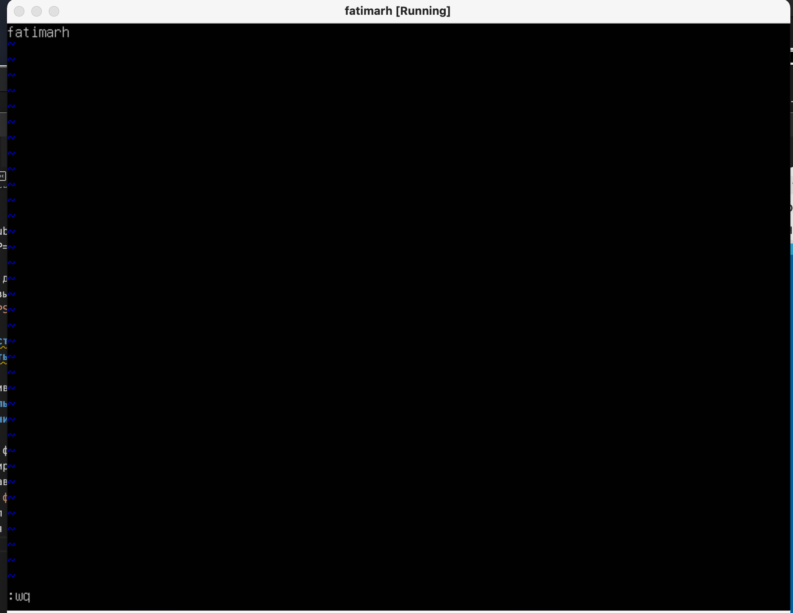
- Создаю файл __`test_nano.txt`__ командой `touch test_nano.txt`
  - Открываю редактор командой : `nano test_nano.txt`
  - Написав никнейм сохраняю содержимое сочетанием клавишь __`control+O`__ затем нажимаю __`enter`__
  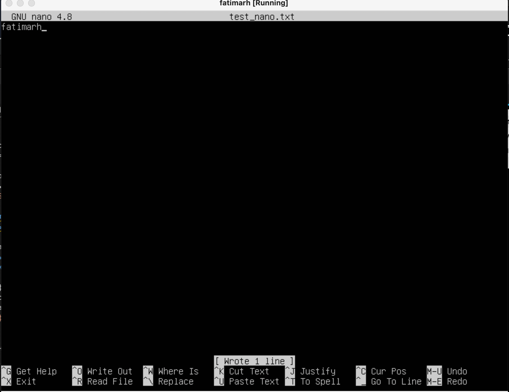
- __Используя каждый из трех выбранных редакторов, откройте файл на редактирование, отредактируйте файл, заменив никнейм на строку "21 School 21", закройте файл без сохранения изменений.__
- Oткрываю файл __`test_mcedit.txt`__ c помощью команды `mcedit test_mcedit.txt`
  - редактирую содержимое файла , для выхода без сохранения использую клавишы __`fn+F10`__ на запрос __`Сохранить при выходе?`__ нажимаю __`Нет`__
  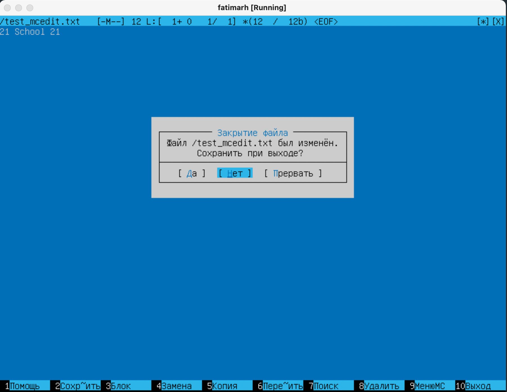
- Открываю файл __`test_vim.txt`__ c помощью команды `vim test_vim.txt`
  - Нажимаю __`i`__ редактирую содержимое файла, затем нажав __`esc`__ прописываю комнаду `:q!` для выхода без сохранения
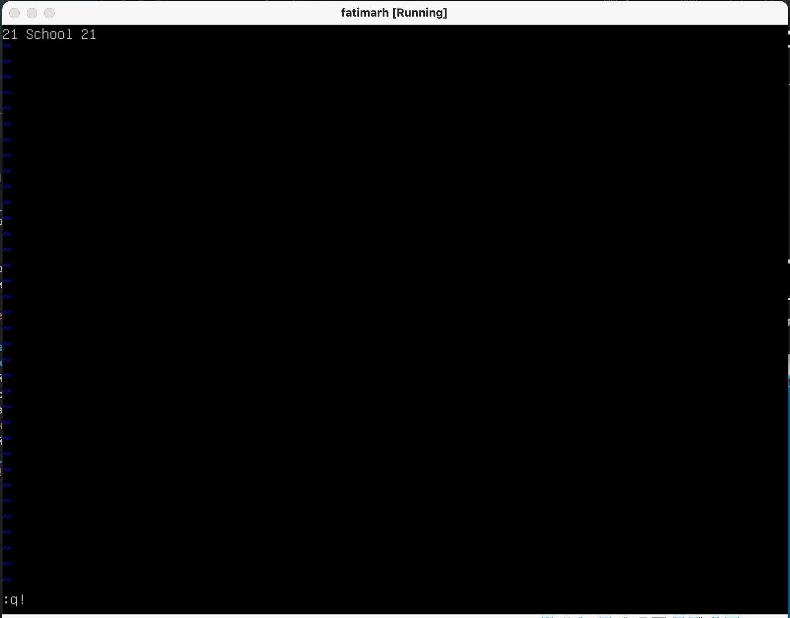
- Открываю файл __`test_nano.txt`__ c помощью команды `nano test_nano.txt`
  - Редактирую содержимое файла затем, затем нажимаю сочетание клавиш __`control+X`__ повяляется окно с вопросом __`Save modified buffer?`__ нажимаю на кнопку __`N`__
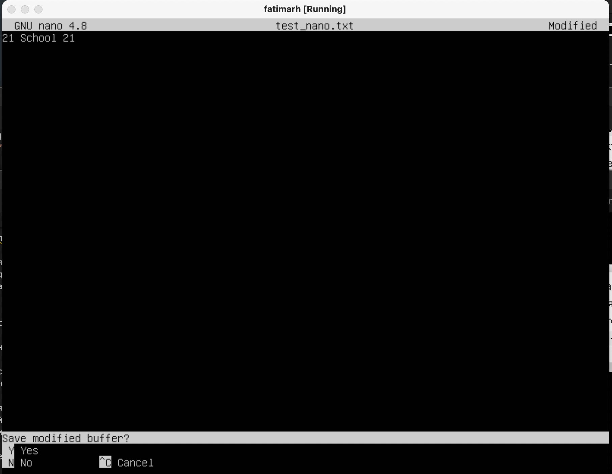
- __Используя каждый из трех выбранных редакторов, отредактируйте файл ещё раз (по аналогии с предыдущим пунктом), а затем освойте функции поиска по содержимому файла (слово) и замены слова на любое другое.__
- В __Vim__ вы можете найти и заменить текст с помощью команды `:substitute ( :s )`.

  Чтобы запускать команды в Vim, вы должны находиться в обычном режиме, который используется по умолчанию при запуске редактора. Чтобы вернуться в обычный режим из любого другого режима, просто нажмите клавишу __`esc`__.

  Общая форма команды замены следующая:

  `:[range]s/{pattern}/{string}/[flags] [count]`
  Команда ищет в каждой строке в `[range] {pattern}` и заменяет его `{string}`.
  `[count]` — положительное целое число, умножающее команду.

  Если не `[range] и [count]` , заменяется только шаблон, найденный в текущей строке. Текущая строка — это строка, в которой находится курсор.
  Чтобы заменить все вхождения шаблона поиска в текущей строке, использую флаг __`g`__.
  Если нужно найти и заменить шаблон во всем файле, использую процентный символ __`%`__ в качестве диапазона. Этот символ указывает диапазон от первой до последней строки файла.
  - использую команду для поиска в файле : `:$s/fatimarh/`
  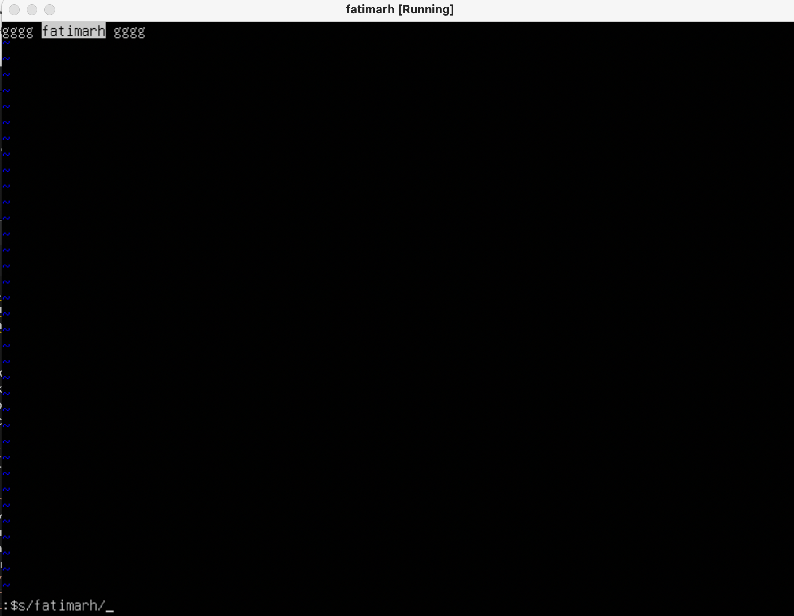
  - для замены найденного текста использую команду : `:$s/fatimarh/NIE FATIMARH A KTO TO DRUGOJ`
  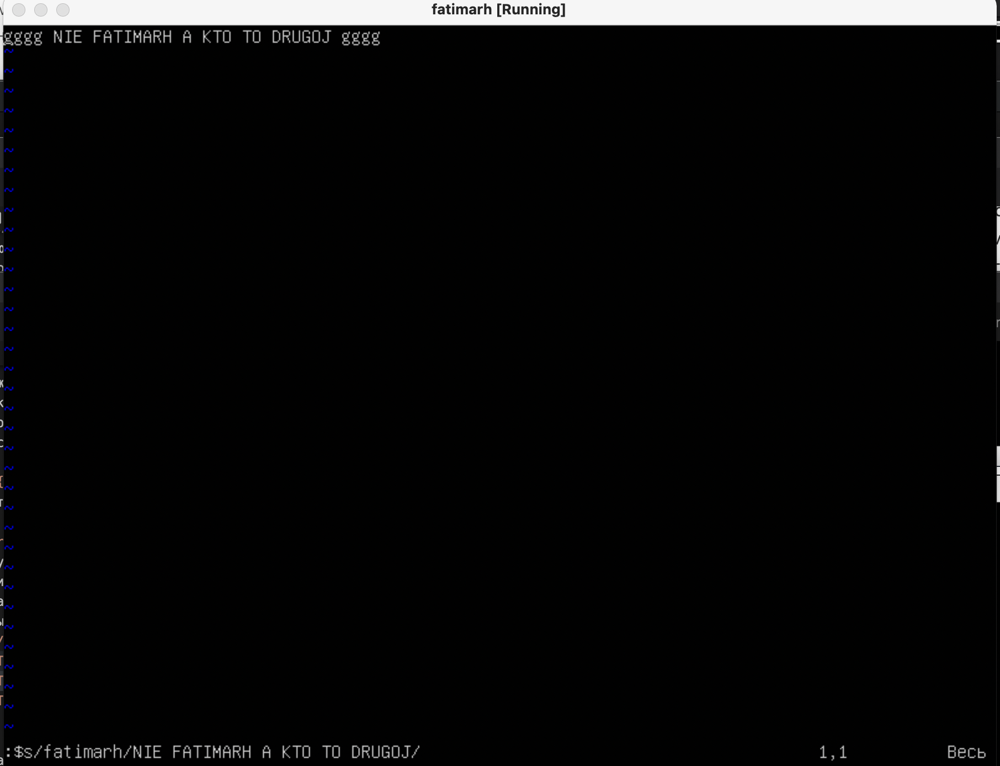
- Поиск в __MCEDIT__ осуществляется с помощью сочентания клавиш __`fn+F7`__ 
  Затем осуществляется ввод искомого слова в строке __`Введите строку для поиска`__.
  Написав паттерн используя кнопку __`Найти все`__ выделяется строка в которой находится данное слово.
  используя там же кнопку __`По шаблону`__  выделяется нужное слово в строке.
  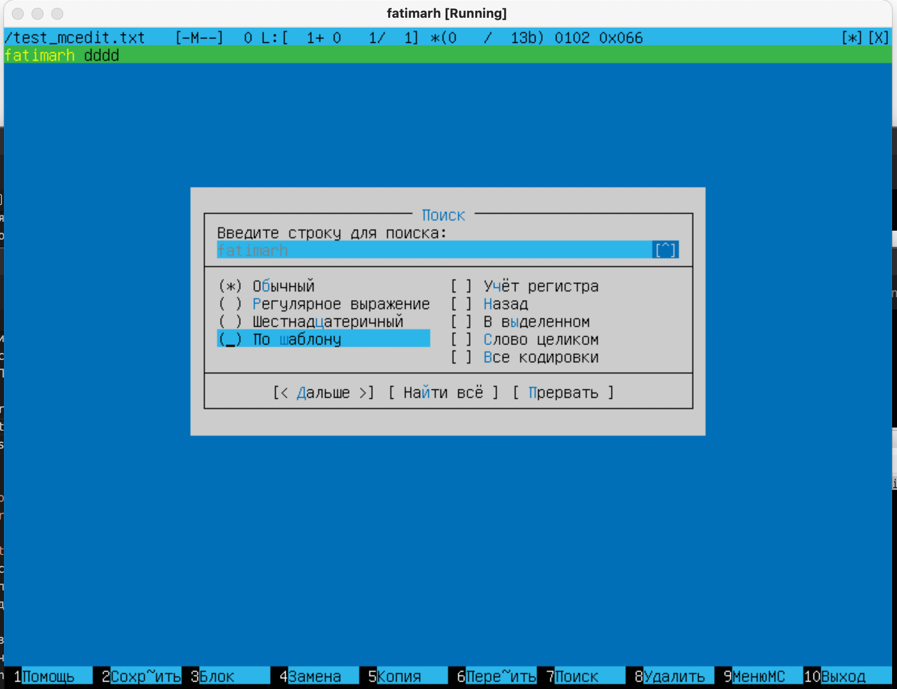
    - Чтобы заменить выделенное слово нужно вопользоваться сочетанием клавиш __`fn+F4`__
    В появившемся окне в строке __`Введите строку для поиска:`__ ввожу слово которое хочу заменить, в строке __`Введите текст для замены:`__ вписываю слово или выражение для замены.
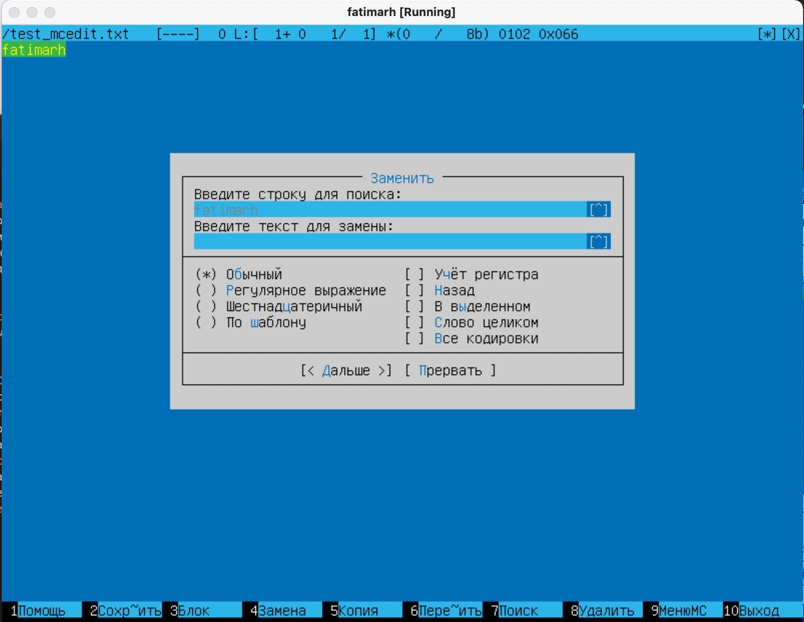
- Затем для осуществления замены нажимаю в окне на кнопу __`<Дальше>`__ которая переводит на следующие окно с подтверждением замены .
В данном окне необходимо нажать на кнопку __`<Заменить>`__ для подтверждения операции.
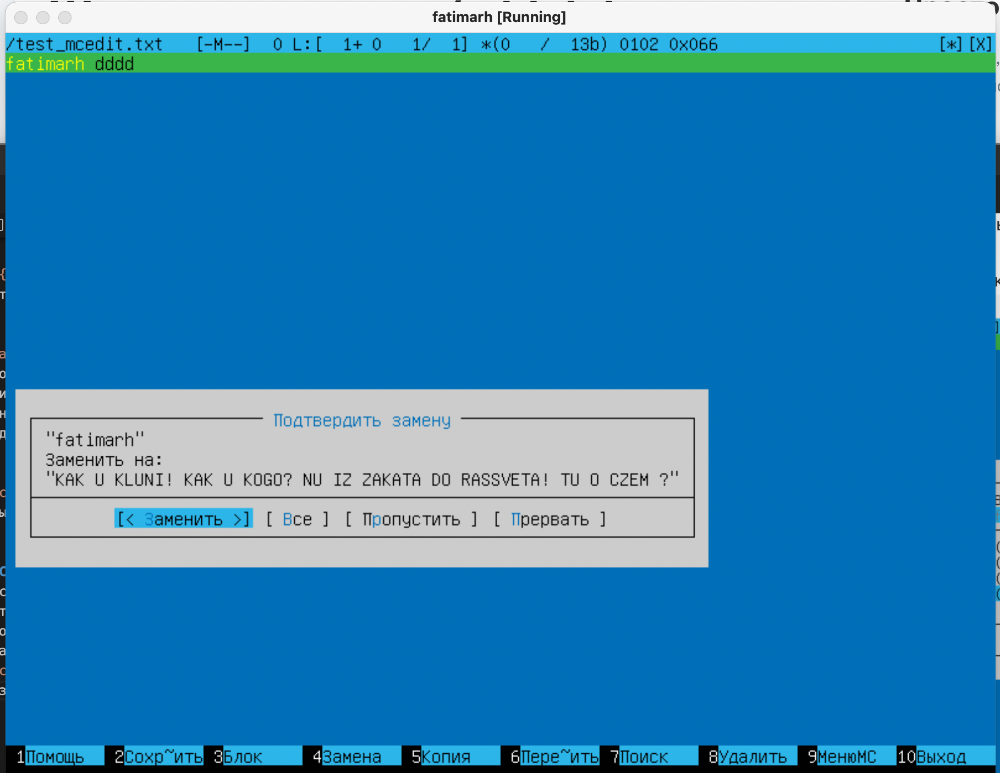
- Осущестлив выше перечисленное вижу на экране уже отредактированный текст.
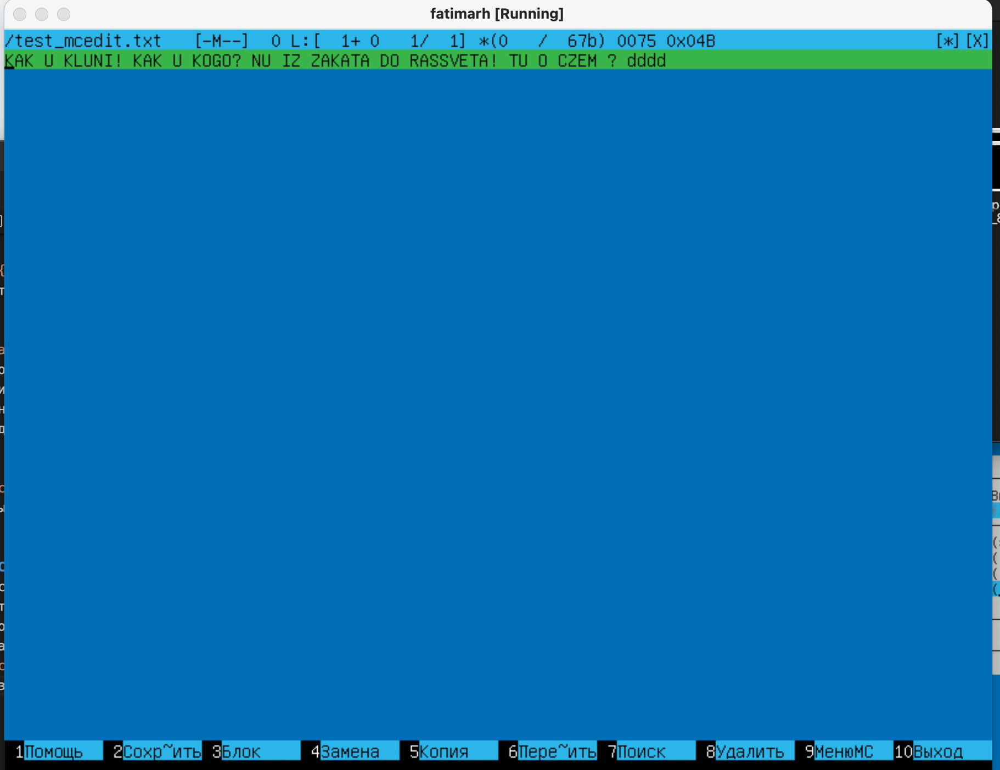

- Поиск и замена текста в __nano__
  Чтобы найти какой либо текст внутри файла используйте сочетание клавиш __`Ctrl+W`__, далее введите строку поиска и нажмите __Enter__. Курсов переместиться на первое вхождение (относительно курсора) искомого текста, чтобы проложить поиск, нажмите сочетание клавиш __`option+W`__ и курсор переместиться к следующему вхождению.

  Чтобы найти и заменить какой-либо текст внутри файла, вам потребуется сочетание клавиш __`Ctrl+\`__ . После его нажатия появится запрос на ввод текста который нужно найти и заменить, введите его и нажмите __Enter__. Далее нужно ввести текст на который выходите заменить, введите его и нажмите __Enter__.

  Далее режим работы такой, при нажатии клавиши:

  __A__ — будет произведена замена всех вхождений искомого текста.

  __Y__ — заменить текст около курсора.

  __N__ — пропустить и не менять текст около курсора.

  - Для поиска использовал комнаду  __`Ctrl+W`__
  Задем ввел слово для поиска в строке __`Search (to replace):`__
  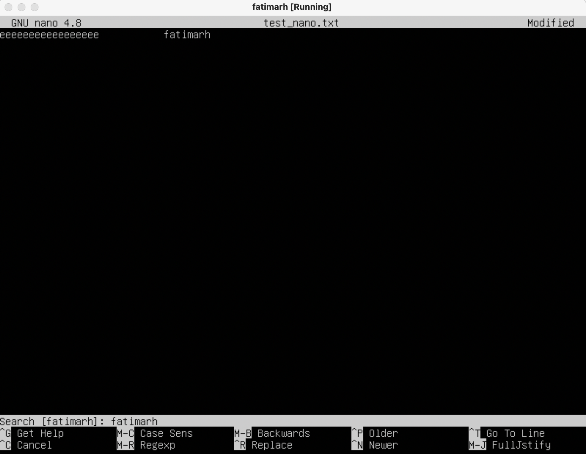
   - Для поиска и замены слова использовал сочетание клавишь __`Ctrl+\`__.
   В строке __`Search (to replace):`__ ввожу слово для поиска.
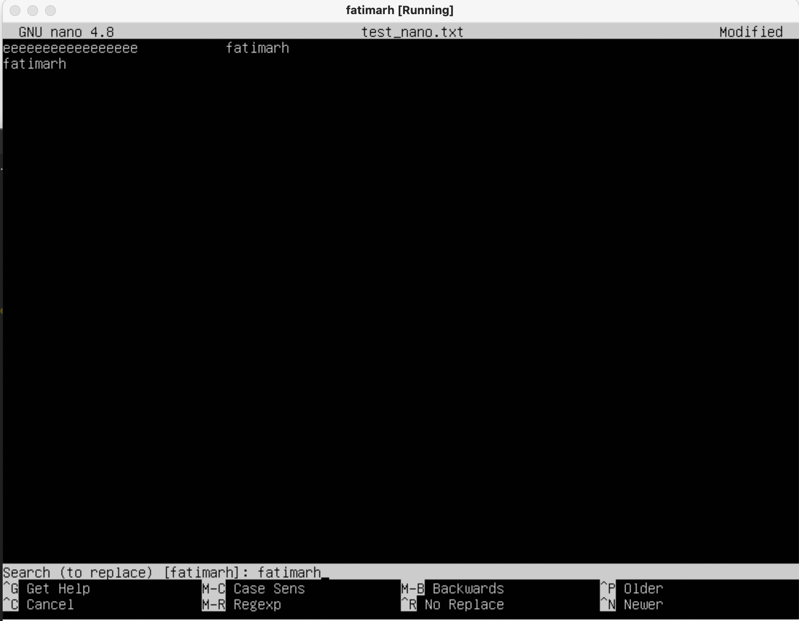
  - Затем в появившемся окне __`Replace with:`__ ввожу слово или фразу на которую хочу поменять.
  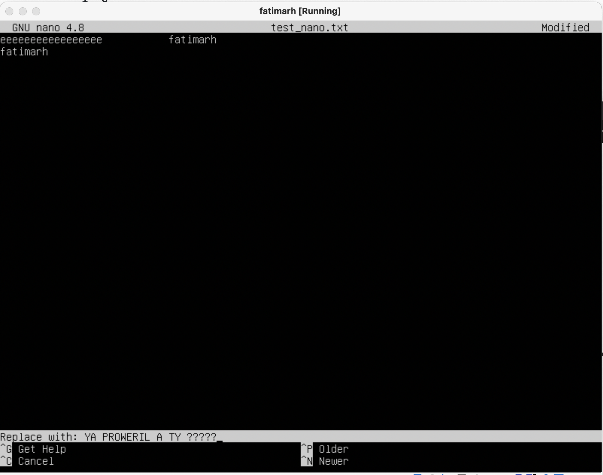
  - нажав __Enter__ появляется состаяние выбора где я использую клавишу  __A__.
  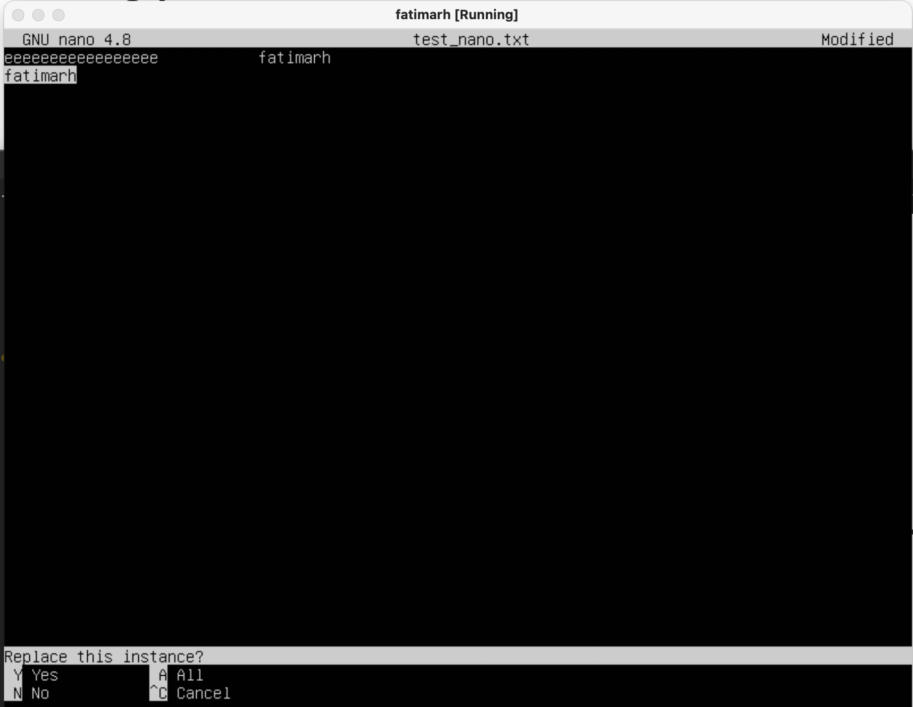
  - Данная клавиша __A__ заменяет каждое вхождение слова в поиске.
  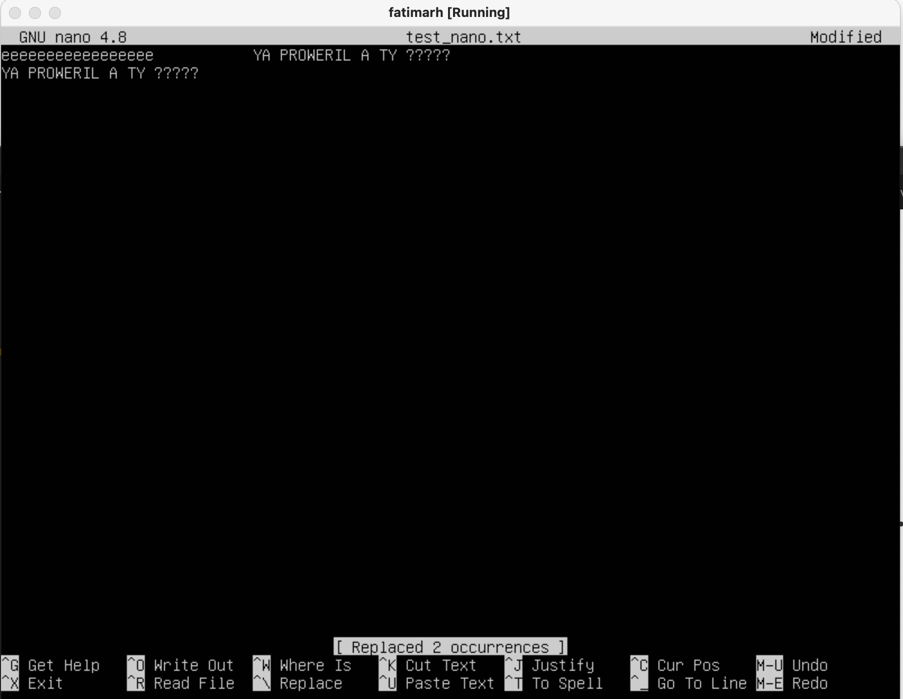
  ___
## Part 8. Установка и базовая настройка сервиса SSHD.
- __Установить службу SSHd.__
  - Обнавляю системные пакеты __apt__ для этого  ввожу команды:
`sudo apt update`
`sudo apt upgrade`
  Устанавливаю __SSH-сервер__ командами:
`sudo apt-get install ssh`
`sudo apt install openssh-server`
После установки пакета сервера __SSH__ __`SSH Daemon`__ (сервер __`SSH`__) будет запущен. Проверяю состояние SSH-сервера, выполнив команду:
`sudo systemctl status sshd`
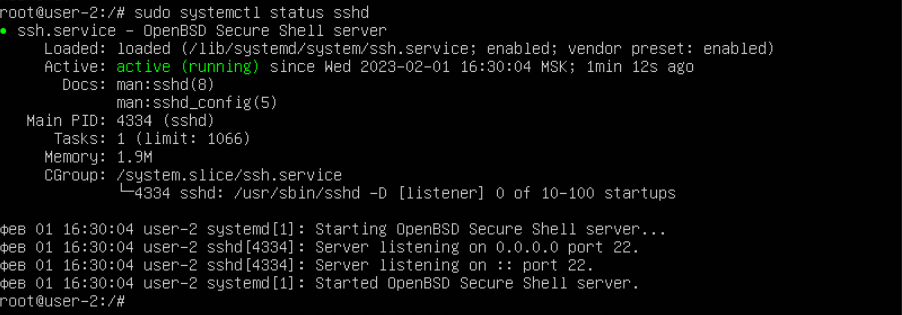
- __Добавить автостарт службы при загрузке системы.__
  - Для включения автостарта службы __`SSH`__ использую команду:
`sudo systemctl enable ssh`
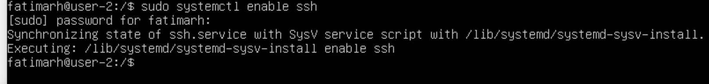
- __Перенастроить службу SSHd на порт 2022.__
  - Что бы изменить порт необходимо внести изменения в конфиг. Для этого нужно отредактировать файл с помощью команды :
`sudo nano /etc/ssh/sshd_config`
В открывшемся файле строку __#Port 22__ раскоментирую строку и изменяю на __Port 2022__ .
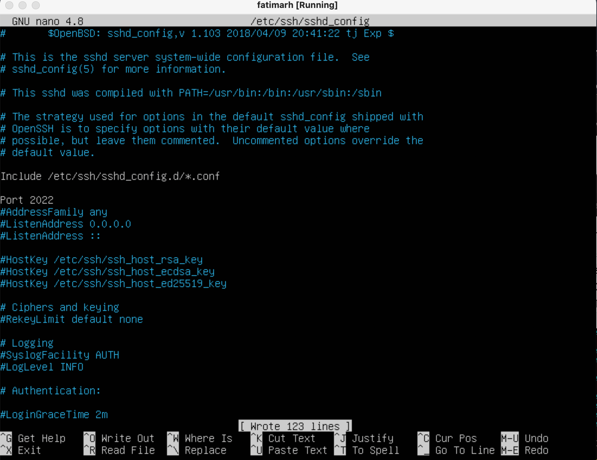
  - Перезапускаю службу командой :`sudo systemctl restart sshd`.
  Перепроверяю измененый порт командой : `sudo systemctl status sshd`
  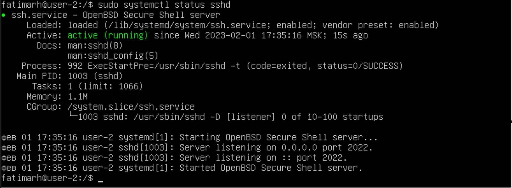
- __Используя команду ps, показать наличие процесса sshd. Для этого к команде нужно подобрать ключи.__
  - Утилита ps одна из самых простых и в то же время часто используемых программ для просмотра списка процессов в Linux. Она не поддерживает интерактивный режим, зато имеет множество опций для настройки вывода тех или иных параметров процессов в Linux.

    Чтобы понять что отображает команда ps сначала надо разобратся что такое процесс. Процесс Linux - это экземпляр программы, запущенный в памяти. Все процессы можно разделить на обычные и фоновые. Более подробно об этом написано в статье управление процессами Linux. Linux - это многопользовательская система, каждый пользователь может запускать одни и те же программы, и даже один пользователь может захотеть запустить несколько экземпляров одной программы, поэтому ядру нужно как-то идентифицировать такие однотипные процессы. Для этого каждому процессу присваивается PID (Proccess Identificator).

    __Запуск__ - процесс либо уже работает, либо готов к работе и ждет, когда ему будет дано процессорное время;
    __Ожидание__ - процессы в этом состоянии ожидают какого-либо события или освобождения системного ресурса. Ядро делит такие процессы на два типа - те, которые ожидают освобождения аппаратных средств и приостановление с помощью сигнала;
    __Остановлено__ - обычно, в этом состоянии находятся процессы, которые были остановлены с помощью сигнала;
   __Зомби__ - это мертвые процессы, они были остановлены и больше не выполняются, но для них есть запись в таблице процессов, возможно, из-за того, что у процесса остались дочерние процессы.
   Команда `ps` в Linux

  Сначала рассмотрим общий синтаксис команды, здесь все очень просто:

 `ps опции`

 `ps опции | grep параметр`

Во втором варианте мы используем утилиту grep для того, чтобы отобрать нужные нам процессы по определенному критерию. Теперь рассмотрим опции утилиты. Они делятся на два типа - те, которые идут с дефисом Unix и те, которые используются без дефиса - BSD. Лучше пользоваться только опциями Unix, но мы рассмотрим и одни и другие. Заметьте, что при использовании опций BSD, вывод утилиты будет организован в BSD стиле.

  __-A, -e, (a)__ - выбрать все процессы;
  __-a__ - выбрать все процессы, кроме фоновых;
  __-d, (g)__ - выбрать все процессы, даже фоновые, кроме процессов сессий;
  __-N__ - выбрать все процессы кроме указанных;
  __-С__ - выбирать процессы по имени команды;
  __-G__ - выбрать процессы по ID группы;
  __-p, (p)__ - выбрать процессы PID;
  __--ppid__ - выбрать процессы по PID родительского процесса;
  __-s__ - выбрать процессы по ID сессии;
  __-t, (t)__ - выбрать процессы по tty;
  __-u, (U)__ - выбрать процессы пользователя.
  __-x__ - найти все вхождения строки поиска.

Опции форматирования:

__-с__ - отображать информацию планировщика;
__-f__ - вывести максимум доступных данных, например, количество потоков;
__-F__ - аналогично -f, только выводит ещё больше данных;
__-l__ - длинный формат вывода;
__-j, (j)__ - вывести процессы в стиле Jobs, минимум информации;
__-M, (Z)__ - добавить информацию о безопасности;
__-o, (o)__ - позволяет определить свой формат вывода;
__--sort, (k)__ - выполнять сортировку по указанной колонке;
__-L, (H)__ - отображать потоки процессов в колонках LWP и NLWP;
__-m, (m)__ - вывести потоки после процесса;
__-V, (V)__ - вывести информацию о версии; 
__-H__ - отображать дерево процессов;

  - Использую команду для вывода: `ps -aux | grep ssh`
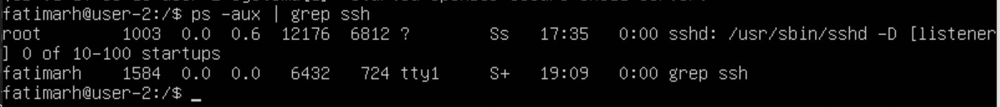
- __Перезагрузить систему.__
  - Вывод команды netstat -tan должен содержать  
`tcp 0 0 0.0.0.0:2022 0.0.0.0:* LISTEN`
    - перезагружаю систему с помощью комануды `sudo reboot`
    устанавливаю программу __netstat__ командой :
    `sudo apt install net-tools`
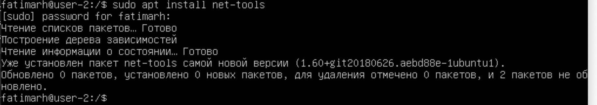
  - __netstat__ (network statistics) — утилита командной строки, выводящая на дисплей состояние TCP-соединений (как входящих, так и исходящих), таблицы маршрутизации, число сетевых интерфейсов и сетевую статистику по протоколам. Доступна в операционных системах семейства UNIX и Windows. Основное назначение утилиты — поиск сетевых проблем и определение производительности сети. 
- Синтаксиси
``` 
netstat [-Aan] [-f семейство_адресов] [-I интерфейс] [-p имя_протокола] [система] [core] 
netstat [-n] [-s] [-i | -r] [-f семейство_адресов] [-I интерфейс] [-p имя_протокола] [система] [core] 
netstat [-n] [-I интерфейс] интервал [система] [core]
```

- Опции

    -__-a__	Показывать состояние всех сокетов; обычно сокеты, используемые серверными процессами, не показываются.
__-A__	Показывать адреса любых управляющих блоков протокола, связанных с сокетами; используется для отладки.
__-b__	Отображение исполняемого файла, участвующего в создании каждого подключения, или ожидающего порта. Иногда известные исполняемые файлы содержат множественные независимые компоненты. Тогда отображается последовательность компонентов, участвующих в создании подключения, либо ожидающий порт. В этом случае имя исполняемого файла находится снизу в скобках [ ], сверху - компонент, который им вызывается, и так до тех пор, пока не достигается TCP/IP. Заметьте, что такой подход может занять много времени и требует достаточных разрешений.
__-i__	Показывать состояние автоматически сконфигурированных (auto-configured) интерфейсов. Интерфейсы, статически сконфигурированные в системе, но не найденные во время загрузки, не показываются.
__-n__	Показывать сетевые адреса как числа. netstat обычно показывает адреса как символы. Эту опцию можно использовать с любым форматом показа.
__-r__	Показать таблицы маршрутизации. При использовании с опцией -s показывает статистику маршрутизации.
__-s__	Показать статистическую информацию по протоколам. При использовании с опцией -r показывает статистику маршрутизации.
__-f__ семейство_адресов	Ограничить показ статистики или адресов управляющих блоков только указанным семейством_адресов, в качестве которого можно указывать:
inet Для семейства адресов AF_INET, или unix Для семейства адресов AF_UNIX.
__-I__ интерфейс	Выделить информацию об указанном интерфейсе в отдельный столбец; по умолчанию (для третьей формы команды) используется интерфейс с наибольшим объёмом переданной информации с момента последней перезагрузки системы. В качестве интерфейса можно указывать любой из интерфейсов, перечисленных в файле конфигурации системы, например, emd1 или lo0.
__-p__	Отобразить идентификатор/название процесса, создавшего сокет (-p, --programs display PID/Program name for sockets)

__TCP/IP__ — сетевая модель передачи данных, представленных в цифровом виде. Модель описывает способ передачи данных от источника информации к получателю.
  - __proto__ - название порта.
__Local address__ - локальный адрес.
__Foreign address__ - внешний адрес, учавствующий в создании соединения.
__State__ - состояние соединения, все варианты.
__CLOSE_WAIT__ - ожидание закрытия соединения.
__CLOSED__ - соединение закрыто.
__ESTABLISHED__ - соединение установлено.
__LISTENING__ - ожидается соединение (слушается порт).
__TIME_WAIT__ - превышение времени ответа.
`Адрес 0.0.0.0` означает «любой IP данного компьютера» и включает в себя в том числе 127.0.0.1. Адрес 0.0.0.0 обычно означает, что IP адрес ещё не настроен или не присвоен. Такой адрес указывает хост, который обращается к __DHCP__ для получения `IP адреса`.

- __вывод команды `netstat -tan`__
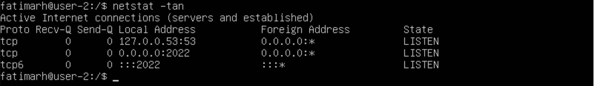
----
## Part 9. Установка и использование утилит top, htop
- Установить и запустить утилиты top и htop.
  - Опций запуска у команды не много и использовать их активно не принято, потому что большинство действий выполняются с помощью интерактивных команд. Вот основные опции:

     - __-v__ — вывести версию программы;
__-b__ — режим только для вывода данных, программа не воспринимает интерактивных команд и выполняется пока не будет завершена вручную;
__-c__ — отображать полный путь к исполняемым файлам команд;
__-d__ — интервал обновления информации;
__-H__ — включает вывод потоков процессов;
__-i__ — не отображать процессы, которые не используют ресурсы процессора;
__-n__ — количество циклов обновления данных, после которых надо закрыть программу;
__-o__ — поле, по которому надо выполнять сортировку;
__-O__ — вывести все доступные поля для сортировки;
__-p__ — отслеживать только указанные по PID процессы, можно указать несколько PID;
__-u__ — выводить только процессы, запущенные от имени указанного пользователя.

- Интерактивные команды, которые вы можно выполнять во время работы программы.

__h__ — вывод справки по утилите;
__q__ или __Esc__ — выход из `top`;
__A__ — выбор цветовой схемы;
__d__ или __s__ — изменить интервал обновления информации;
__H__ — выводить потоки процессов;
__k__ — послать сигнал завершения процессу;
__W__ — записать текущие настройки программы в конфигурационный файл;
__Y__ — посмотреть дополнительные сведения о процессе, открытые файлы, порты, логи и т д;
__Z__ — изменить цветовую схему;
__l__ — скрыть или вывести информацию о средней нагрузке на систему;
__m__ — выключить или переключить режим отображения информации о памяти;
__x__ — выделять жирным колонку, по которой выполняется сортировка;
__y__ — выделять жирным процессы, которые выполняются в данный момент;
__z__ — переключение между цветным и одноцветным режимами;
__c__ — переключение режима вывода команды, доступен полный путь и только команда;
__F__ — настройка полей с информацией о процессах;
__o__ — фильтрация процессов по произвольному условию;
__u__ — фильтрация процессов по имени пользователя;
__V__ — отображение процессов в виде дерева;
__i__ — переключение режима отображения процессов, которые сейчас не используют ресурсы процессора;
__n__ — максимальное количество процессов, для отображения в программе;
__L__ — поиск по слову;
__<>__ — перемещение поля сортировки вправо и влево;
Это далеко не все команды top, но их будет вполне достаточно для начала работы, а остальные вы сможете найти в официальной документации по утилите.

- __ЗАПУСК ПРОГРАММЫ__
Для установки программы использую команду:

`sudo apt install top`

Затем для запуска просто выполняю команду:

`top`

Окно можно условно разделить на две части. В верхней части находится информация о системе, общем использовании ресурсов процессора и памяти, раздела подкачки, и так далее. В нижней части окна расположен список запущенных процессов с информацией, отсортированных по определённому полю.

Если все процессы не помещаются на одном экране, их можно листать с помощью стрелок вверх и вниз. Если не помещаются все колонки — с помощью стрелок вправо и влево.
Если не помещаются все колонки - с помощью стрелок вправо и влево.
- __uptime__ - время последней перезагрузки.
для запуска использовал команду:
`uptime`

- Вывод команды :
`top`
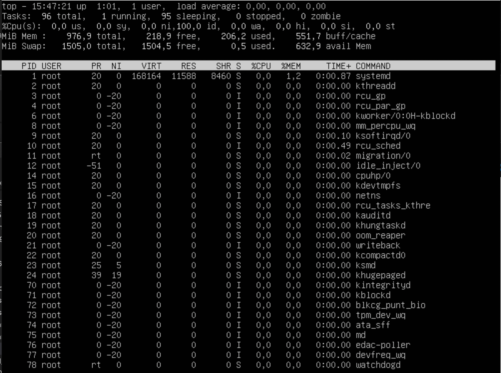
    - Слева вверху указано текущее время системы, далее:
__Up__ — время работы системы с последнего запуска. -> 1:01 min
__User__ — количество текущих пользователей. -> 1 user
__Load average__ — средняя нагрузка на сервер: отображаются значения за 1, 5 , 15 минут назад. ->0.00 0.00, 0.00
__Tasks__ — общее количество запущенных процессов в разных статусах (running — выполняемые; sleeping — в ожидании; stopped — остановленные; zombie — «зомби», дочерние процессы, ожидающие завершения родительского процесса). -> 96 total, 1 running, 95 sleeping, 0 stopped, 0 zombie
__Cpu(s)__ — процент времени процессора, затраченного на выполнение процессов, в том числе:
__us__ — пользовательские процессы (высокое значение данного показателя может указывать, в том числе, на проблемы в коде сайта, необходимость его оптимизации); -> 0.0
__sy__ — процессы ядра; -> 0.0
__id__ — неиспользуемые ресурсы (чем выше этот показатель, тем лучше); -> 100.0
__wa__ — операции ввода/вывода, т.е. дисковые операции. -> 0.0
__Mem, Swap__ — сведения об использовании оперативной памяти (total — общий объем, free — объем свободной памяти, used — объем использованной памяти). -> Mem total 976.9, Mem free 218.9, Mem used 206.2, Swap total 1505.0, Swap free 1504.5, Swap used 0.5
- Команда (утилита) __w__ — отображает информацию о пользователях которые в настоящее время есть на машине, и их процессов. Внутри заголовка, показывается текущее время, как долго система работает, сколько пользователей в настоящее время вошли в систему, и среднюю нагрузку системы за последние 1, 5, 15 минут.
Прописываю команду:
`w`
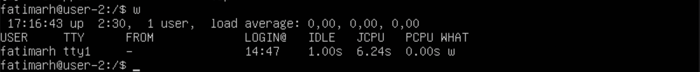
- Аналогично утилите top, можно использовать htop, что намного проще. Пользовательский интерфейс программы htop основан на Ncurses. Представление информации действительно чистое. С помощью этого инструмента можно фильтровать, управлять и делать другие интересные вещи, связанные с процессами, запущенными в системе. Это отличный инструмент для системных администраторов Gnu / Linux.
  - запускаю команду:
`htop`
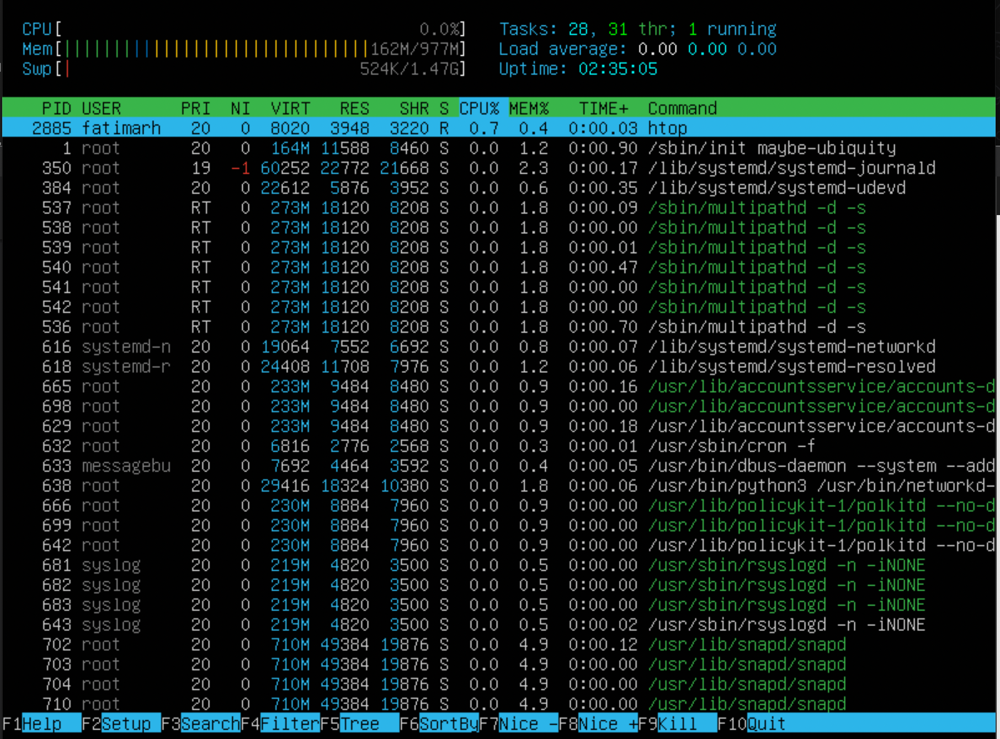
Обозначения столбцов:
__PID__ — идентификатор процесса;
__USER__ — пользователь, запустивший процесс;
__PR__ — приоритет процесса;
__NI__ — измененный приоритет (присвоенный пользователем с помощью команды nice);
__VIRT__ — объем используемой виртуальной памяти (здесь выводится тот объем памяти, который был запрошен процессом, даже если фактически используется меньше);
__RES__ — объем используемой оперативной памяти
__SHR__ — объем памяти, разделяемой с другими процессами (т.е. память, которая может быть использована другими процессами);
__S__ — статус процесса (running — запущен; sleeping — в ожидании; zombie — процесс-«зомби»)
__D__ = бесперебойный сон;
__I__ = простой (не работает);
__R__ = запущен;
__S__ = спит;
__T__ = остановлен сигналом управления работой;
__t__ = остановлен отладчиком во время трассировки;
__Z__ = зомби.
__%CPU__ — процент использования процессорного времени;
__%MEM__ — процент использования оперативной памяти;
__TIME__ — общее время работы процесса;
__COMMAND__ — имя процесса (команда, которой был запущен процесс).
- Для управления сортировкой используются клавиши __M__ (сортировка по памяти), __P__ (по процессору), __T__ (по времени), аналогично утилите `top`. Так же можно воспользоваться клавишей __F6 -> SortBy__.
При нажатии клавиши __F6__ экран сменится и будет предоставлен выбор вариантов сортировки. Выбираем необходимый вариант с помощью стрелок ввер, вниз и нажимаем enter.
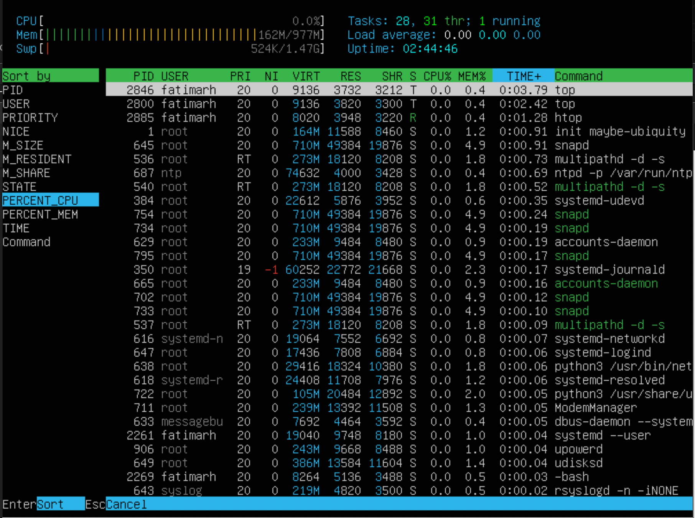
  - Сортировка по  __PID__
  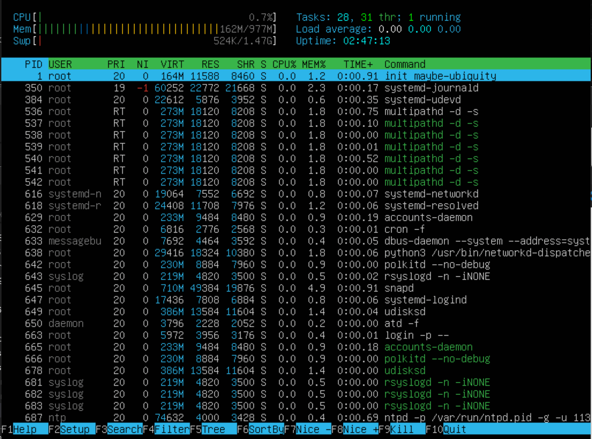
  - Сортировка по __PERCENT_CPU__
  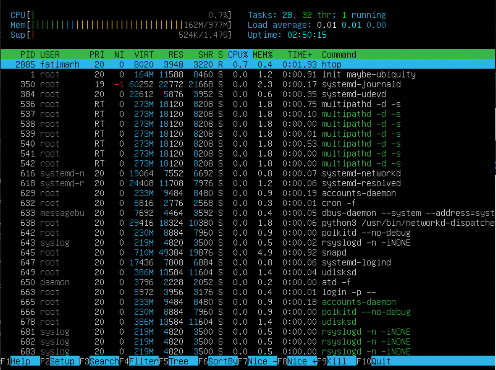
  - Сортировка по __PERCENT_MEM__
  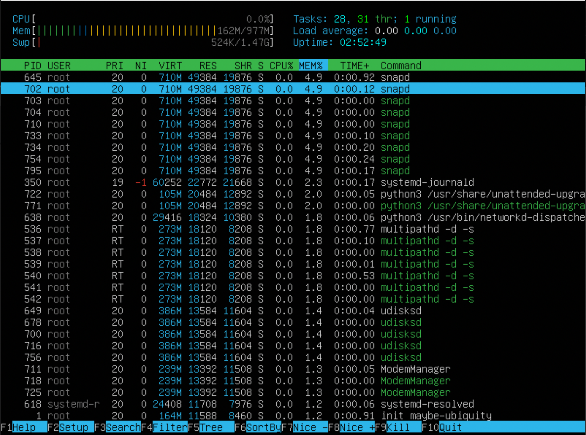
  - Сортировка по __TIME__
  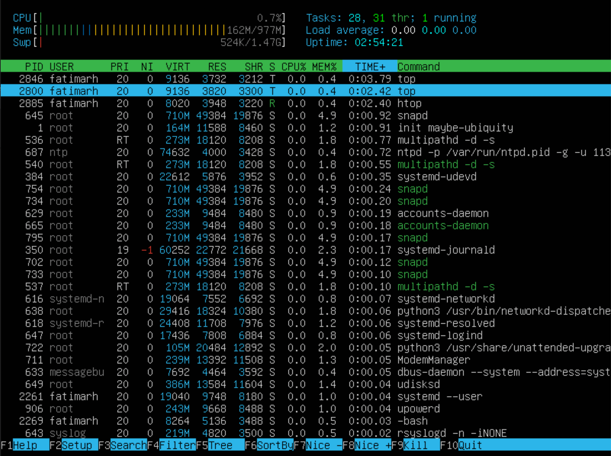
  
- Для выводов данных __PID, PERCENT_CPU, PEERCENT_MEM, TIME__ 
выполняю фильтрации по процессу `sshd`.
Использую клавишу __F4 -> Filter__.
    - процесс __sshd__ по __PID__
    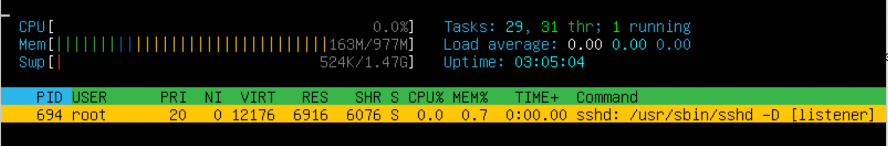
    - процесс __sshd__ по __PERCENT_CPU__
    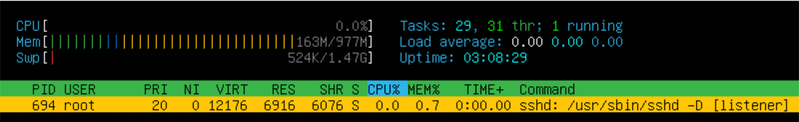
    - процесс __sshd__ по __PEERCENT_MEM__
    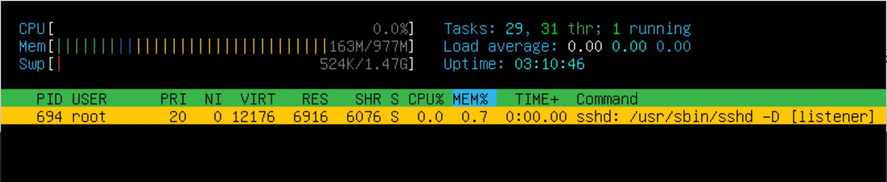
    - процесс __sshd__ по __TIME__
    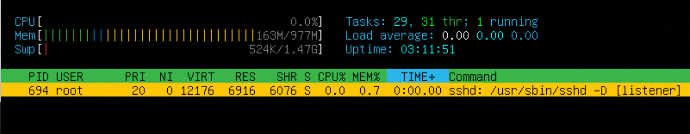
- Для поиска процесса `syslog` необходимо отключить предыдущую настройку фильтрации.
Затем воспользоваться клавишей __F3 -> Search__.
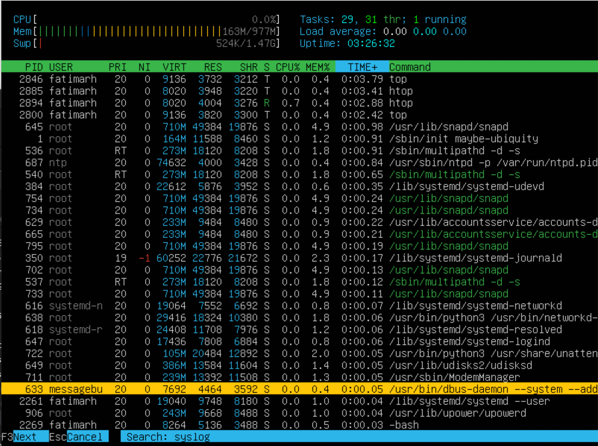
- Нажав клавишу __F2 -> Setup__, перемещаюсь клавишей `->` вправа для добавления пунктов hostname, clock и uptime в панель вывода.
Данная панель появляется автоматически в правом верхнем углу либо можно добавить в левый угол на выбор.
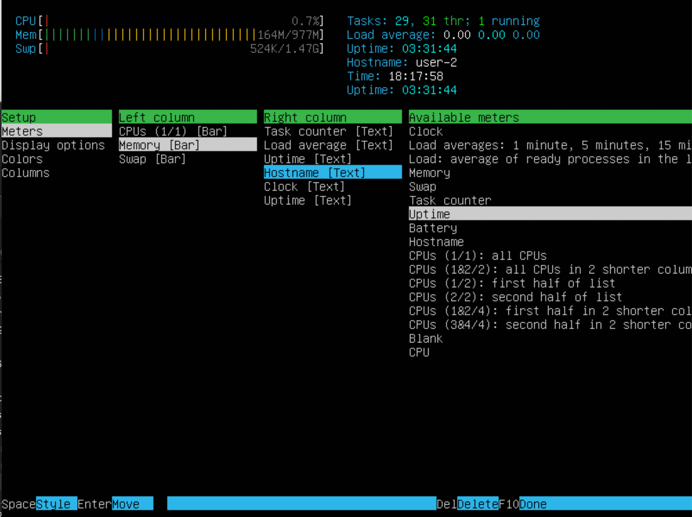
----
## __Part 10. Использование утилиты fdisk__
- Запустить команду __fdisk -l.__
  - Синтаксис утилиты ничем не отличается от других команд Linux:
`fdisk опции устройство`
__fdisk__ надо передать опции, согласно действия, которое вы хотите выполнить, а также раздел диска или устройство к которому эти действия надо применить.
Опции __fdisk__:
__-B__, __--protect-boot__ - не стирать первые 512 байт диска чтобы не повредить загрузочную запись;
__-L, --color__ - настройка цветного вывода, возможные значения auto, never или always;
__-l, --list__ - вывести все разделы на выбранных устройствах или если устройств не задано, то на всех устройствах;
__-o, --output__ - указывает какие поля данных надо показывать в выводе программы, доступные поля рассмотрим ниже;
__-u, --units__ - настраивает формат вывода размера разделов, доступные значения: cylinders, sectors, по умолчанию используется sectors;
__-w, --wipe__ - режим стирания файловой системы или RAID с диска, возможные значения auto, never или always по умолчанию используется auto;
__-W, --wipe-partition__ - режим стирания файловой системы или RAID из только что созданного раздела. Возможные значения аналогичны предыдущей опции;
__-h, --help__ - показать справку по утилите;
__-v, --version__ - опция выводит версию утилиты.
  -  Команды __fdisk__:

     __a__ - включение или выключения флага boot для раздела;
__d__ - удалить раздел;
__F__ - показать свободное место;
__l__ - вывести список известных типов разделов;
__n__ - создать новый раздел;
__p__ - вывести таблицу разделов;
__t__ - изменение типа раздела;
__i__ - вывести информацию о разделе;
__I__ и __O__ - записать или загрузить разметку в файл сценария sfdisk;
__w__ - записать новую таблицу разделов на диск;
__q__ - выйти без сохранения;
__g__ - создать пустую таблицу разделов GPT;
__o__ - создать пустую таблицу разделов MBR.
- Использую команду:
`sudo fdisk -l`
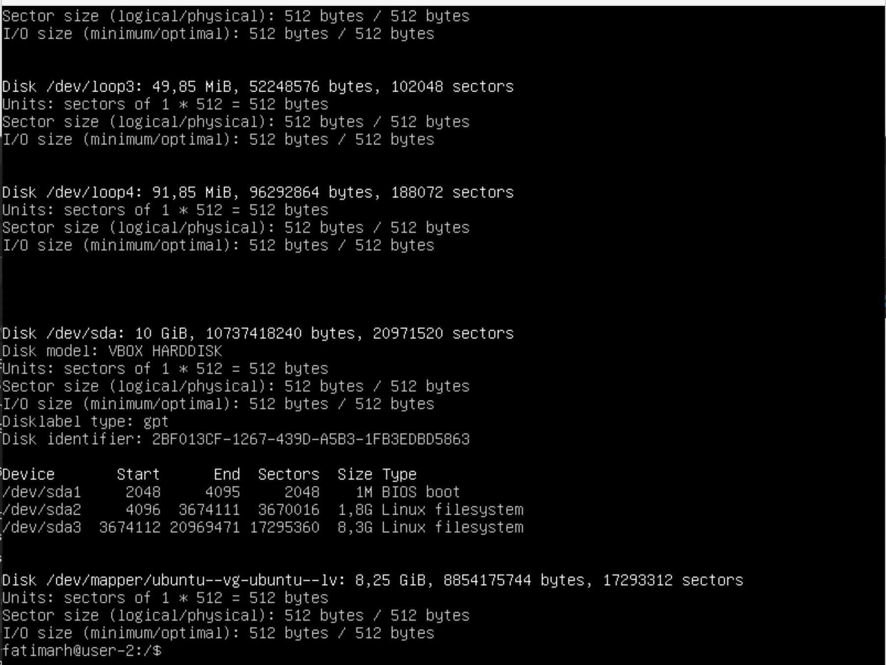
Название жёсткого диска: sda.
Размер жёсткого диска: 10GiB.
Количество секторов: 17293312 sectors.
При созаний виртуальной машины swap не создавался.
----
## Part 11. Использование утилиты df
- Запустить команду df.
    - Утилита __df__ поставляется по умолчанию во всех дистрибутивах Linux и имеет очень простой синтаксис. Фактически вы можете просто набрать df и уже получить результат, но чтобы сделать вывод более читаемым используются дополнительные опции. Вот основной синтаксис:
`df опции устройство`
Устройство указывать необязательно, но можно указать раздел диска, о котором мы хотим посмотреть информацию. 
Основные опции утилиты:
__-a, --all__ - отобразить все файловые системы, в том числе виртуальные, псевдо и недоступные;
__-B__ - изменить размер одного блока перед выводом данных, например, можно использовать __BM__, чтобы вывести все данные в мегабайтах;
__-h__ - выводить размеры в читаемом виде, в мегабайтах или гигабайтах;
__-H__ - выводить все размеры в гигабайтах;
__-i__ - выводить информацию об inode;
__-k__ - выводить размеры в килобайтах;
__--output__ - использовать специальный формат вывода, если не задано, выводит все поля. Доступны такие варианты: `'source', 'fstype', 'itotal', 'iused', 'iavail', 'ipcent', 'size', 'used', 'avail', 'pcent', 'file' , 'target';`
__-P__ - использовать формат вывода __POSIX__;
__--total__ - выводить всю информацию про использованное и доступное место;
__-t__, --type - выводить информацию только про указанные файловые системы;
__-x__ - выводить информацию обо всех, кроме указанных файловых систем.
Утилита отображает стандартный набор колонок, но понять в ее выводе что-то с первого раза сложно. Все данные выводятся в килобайтах. 
Для вывода данных в более читаемом виде использую команду:
`sudo df`
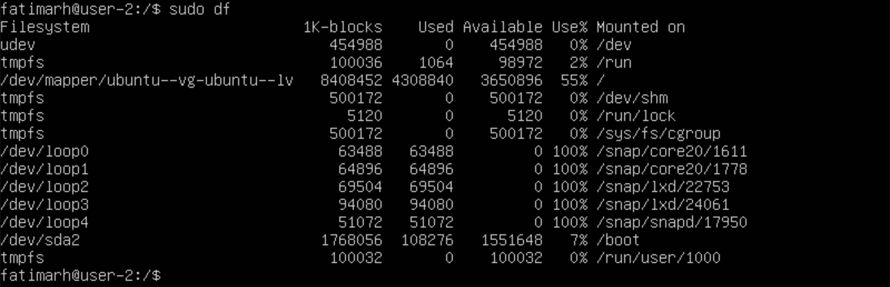
Размер корневого раздела: 8408452. (Данные выводятся в килобайтах.)
Размер занятого пространства: 4308840. (Данные выводятся в килобайтах.)
Размер свободного пространства: 3650896. (Данные выводятся в килобайтах.)
Процент использования; 55%.
Для получения информации о типе файловой системы использую команду:
`sudo df --output`
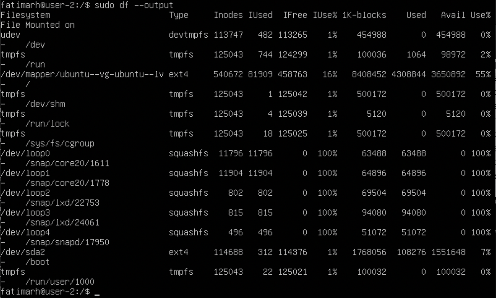
Используется файловая система ext4.
Ext4 — журналируемая файловая система, предлагаемая для использования по умолчанию инсталятором Ubuntu, начиная с версии 9.10.
- Запустить команду __df -Th.__
`sudo df -Th`
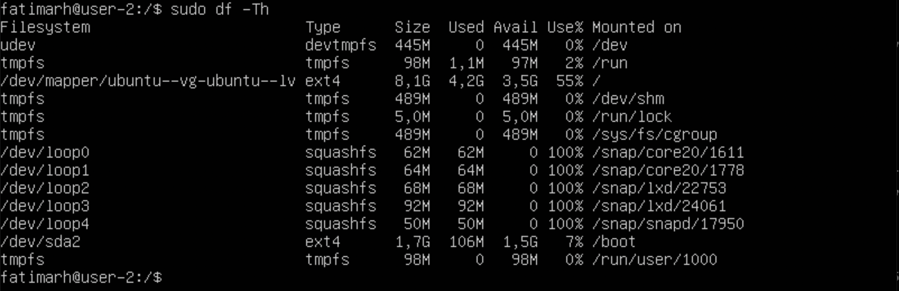
Размер корневого раздела: 8.1G. (Данные выводятся в гигабайтах.)
Размер занятого пространства: 4.2G. (Данные выводятся в гигабайтах.)
Размер свободного пространства: 3.5G. (Данные выводятся в гигабайтах.)
Процент использования; 55%.
Мы видим, что используется файловая система ext4.
Ext4 — журналируемая файловая система, предлагаемая для использования по умолчанию инсталятором Ubuntu, начиная с версии 9.10.
---
## Part 12. Использование утилиты du
- __Запустить команду du.__
    - Синтаксис команды __du__ не сложный. 
    Достаточно передать ей опции и путь к папке с которой нужно работать:
`du опции /путь/к/папке`
Oпции утилиты __du__:
__-a, --all__ - выводить размер для всех файлов, а не только для директорий, по умолчанию размер выводится только для папок;
__-B, --block-size__ - указать единицы вывода размера, доступно: `K,M,G,T,P,E,Z,Y` для 1024 и KB, MB и так далее для 1000;
__-c, --total__ - выводить в конце общий размер всех папок;
__-d, --max-depth__ - максимальная глубина вложенности директорий;
__-h, --human-readable__ - выводить размер в единицах измерения удобных для человека;
__--inodes__ - выводить информацию об использованию inode;
__-L, --dereference__ - следовать по всем символическим ссылкам;
__-l, --count-links__ - учитывать размер файла несколько раз для жестких ссылок;
__-P, --no-dereference__ - не следовать по символическим ссылкам, это поведение используется по умолчанию;
__-S, --separate-dirs__ - не включать размер подпапок в размер папки;
__--si__ - выводить размер файлов и папок в системе си, используется 1000 вместо 1024;
__-s, --summarize__ - выводить только общий размер;
__-t, --threshold__ - не учитывать файлы и папки с размером меньше указанного;
__--time__ - отображать время последней модификации для файла или папки, вместо времени модификации можно выводить такие метки: atime, access, use, ctime;
__-X, --exclude__ - исключить файлы из подсчёта;
__-x, --one-file-system__ - пропускать примонтированные файловые системы;
__--version__ - вывести версию утилиты.
 - Выполняю команду:
`sudo du`
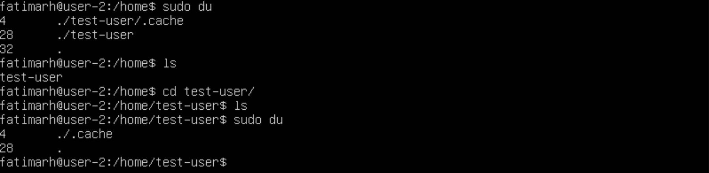
- __Вывести размер папок /home, /var, /var/log (в байтах, в человекочитаемом виде)__
  - Ввожу команды:
 `cd`
 `du home`
 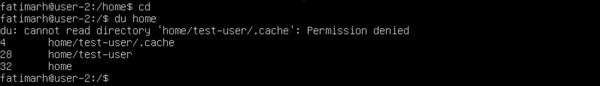
Ввожу команду:
`sudo du -h home`
 
 Ввожу команду:
 `sudo du var`
  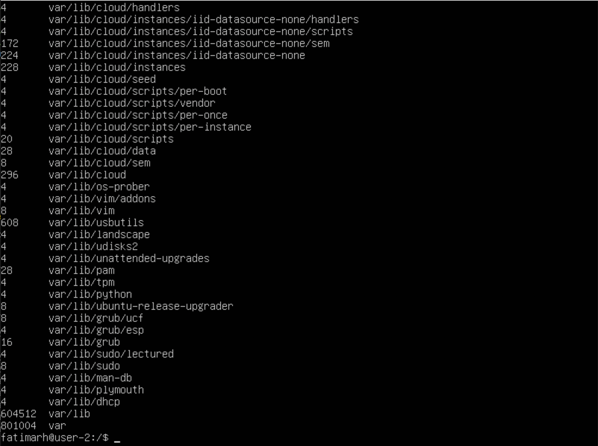
  Ввожу команду:
 `sudo du -h var` 
  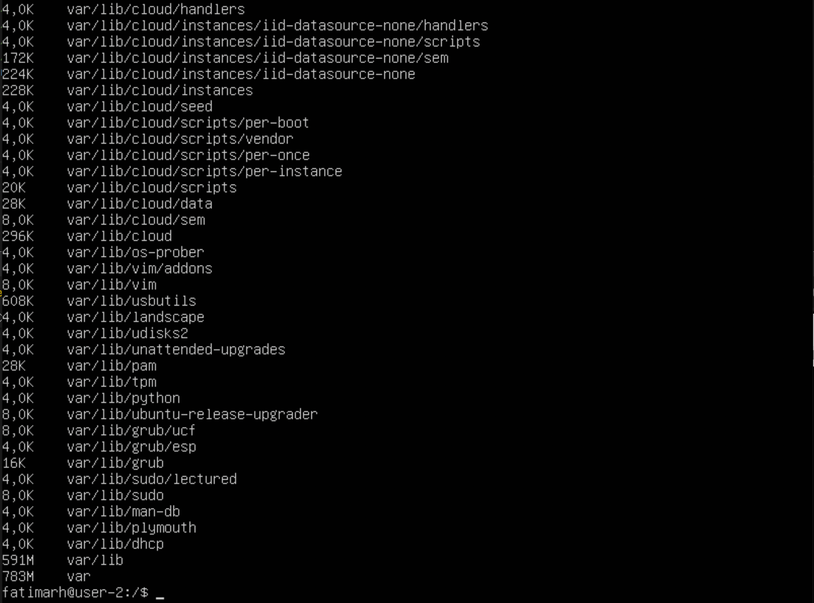
  Ввожу команду:
 `sudo du var/log`
  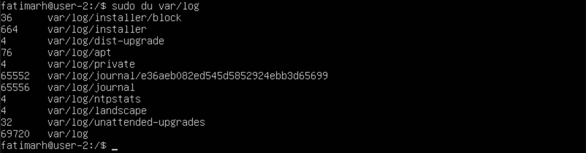
  Ввожу команду:
   `sudo du -h var/log`
  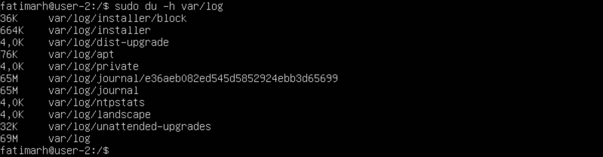
- __Вывести размер всего содержимого в /var/log (не общее, а каждого вложенного элемента, используя *)__
  -  Ввожу команду:
  `sudo du -h var/log/*`
  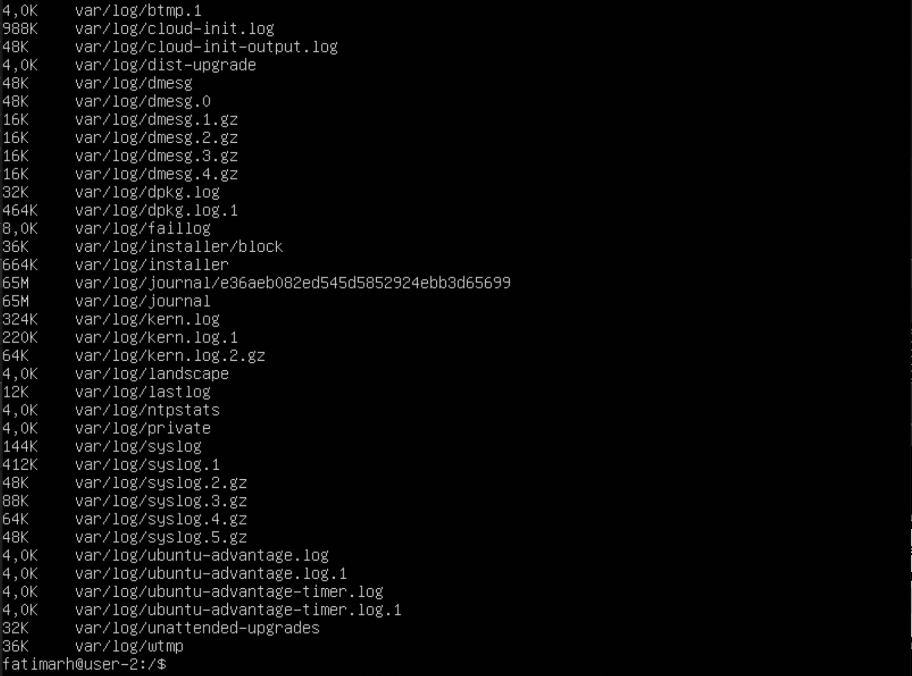
  ----
## Part 13. Установка и использование утилиты ncdu
- __Установить утилиту ncdu.__
  - __ncdu__ (NCurses Disk Usage) является инструментом командной строки для просмотра и анализа использования дискового пространства на Linux. Он может показать древовидные каталоги и дать отчет о свободном пространстве на нашем диске, используемого в отдельных каталогах. Таким образом, очень легко отследить сколько занимает места файлы / каталоги. Он на самом деле позволяет пользователю сделать это гораздо быстрее, чем менеджеры с графическим интерфейсом.
__ncdu__ доступен по умолчанию в Ubuntu, Linux Mint и в репозитории Debian.
 Установливаю выполнив команду:
`sudo apt install nsdu`

- __Вывести размер папок /home, /var, /var/log.__
  - Для этого ввожу комнады:
  `cd`
`ncdu home`
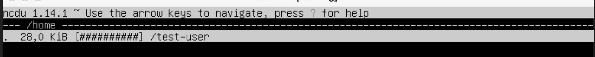
`ncdu var`
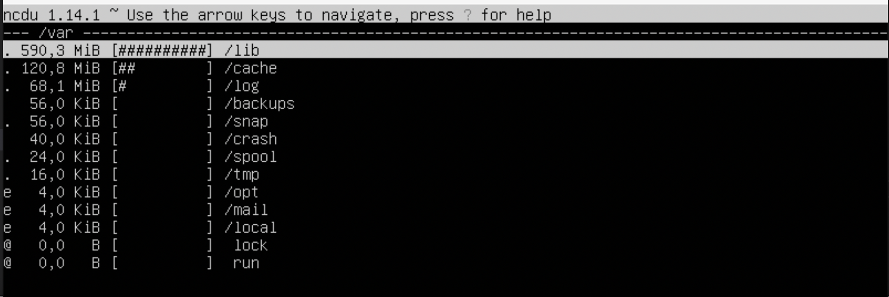
`ncdu var/log`
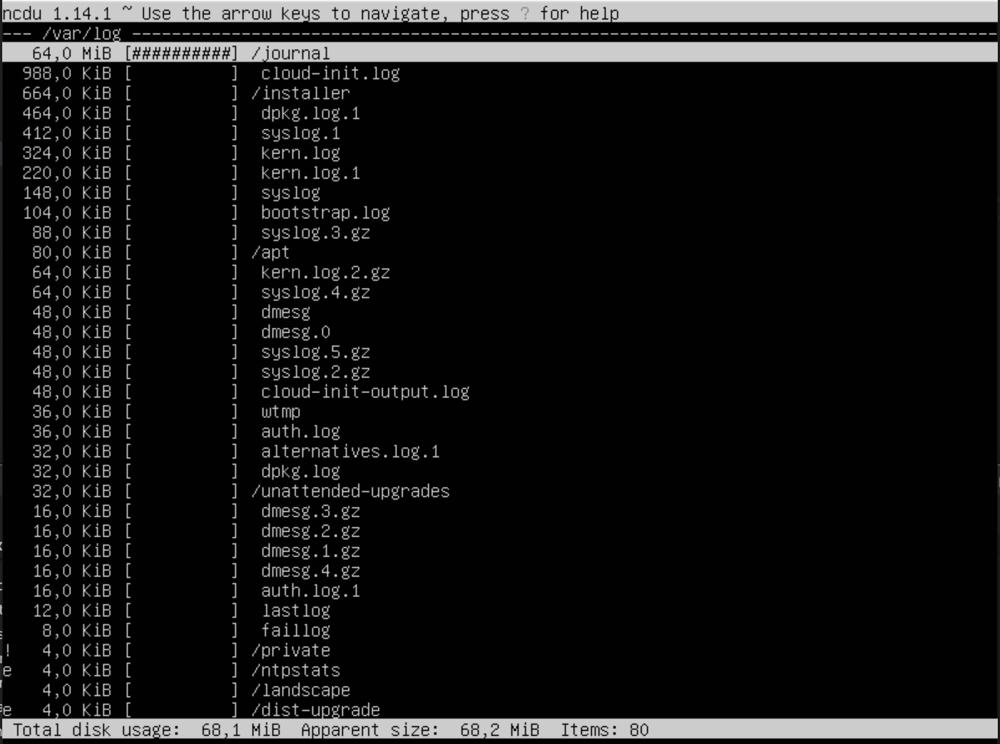
-----
## Part 14. Работа с системными журналами
- __Открыть для просмотра:__
  - __/var/log/dmesg__
    - использую команду:
    `vim /var/log/dmesg`
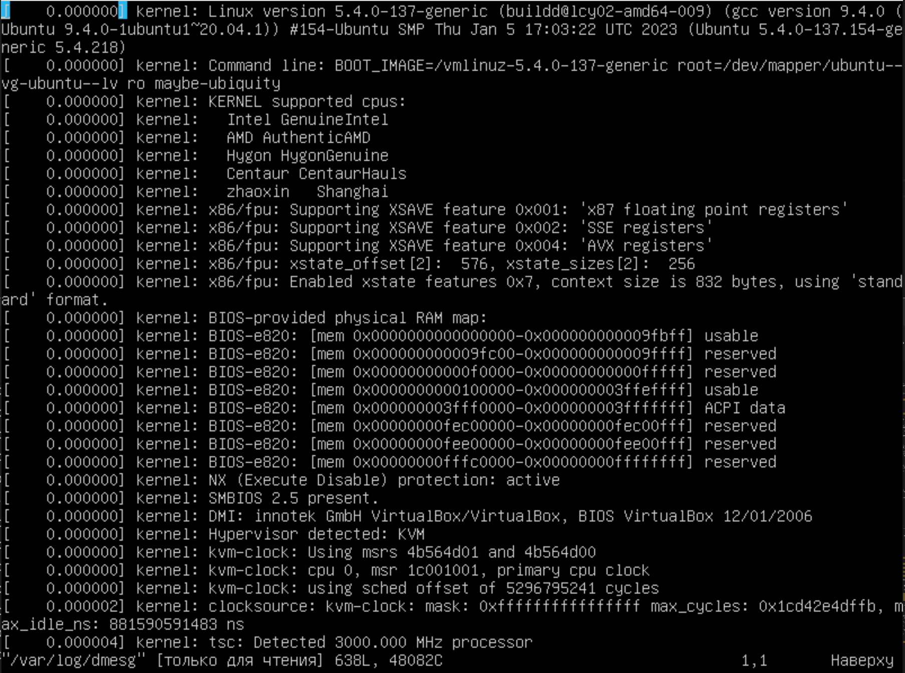
  - __/var/log/syslog__
    - использую команду:
    `vim /var/log/syslog`
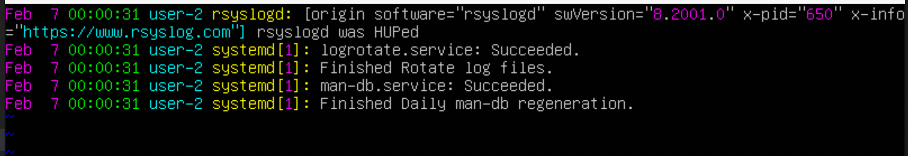
  - __/var/log/auth.log__
    - использую команду:
    `sudo vim /var/log/auth.log`
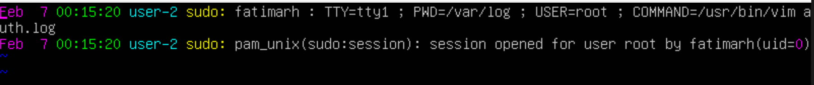

  Большинство лог файлов содержится в директории __/var/log__.
`/var/log/syslog` или `/var/log/messages` содержит глобальный системный журнал, в котором пишутся сообщения с момента запуска системы, от ядра Linux, различных служб, обнаруженных устройствах, сетевых интерфейсов и много другого.
`/var/log/auth.log` или `/var/log/secure` — информация об авторизации пользователей, включая удачные и неудачные попытки входа в систему, а также задействованные механизмы аутентификации.
__`/var/log/dmesg`__ — драйвера устройств. Одноименной командой можно просмотреть вывод содержимого файла. Размер журнала ограничен, когда файл достигнет своего предела, старые сообщения будут перезаписаны более новыми. Задав ключ `--level=` можно отфильтровать вывод по критерию значимости.
`/var/log/alternatives.log` — Вывод программы `update-alternatives`, в котором находятся символические ссылки на команды или библиотеки по умолчанию.
`/var/log/anaconda.log` — Записи, зарегистрированные во время установки системы.
`/var/log/audit` — Записи, созданные службой аудита __auditd__.
`/var/log/boot.log` — Информация, которая пишется при загрузке операционной системы.
`/var/log/cron` — Отчет службы crond об исполняемых командах и сообщения от самих команд.
`/var/log/cups` — Все, что связано с печатью и принтерами.
`/var/log/faillog` — Неудачные попытки входа в систему. Очень полезно при проверке угроз в системе безопасности, хакерских атаках, попыток взлома методом перебора. Прочитать содержимое можно с помощью команды __faillog__.
`var/log/kern.log` — Журнал содержит сообщения от ядра и предупреждения, которые могут быть полезны при устранении ошибок пользовательских модулей встроенных в ядро.
`/var/log/maillog/` или `/var/log/mail.log` — Журнал почтового сервера, используемого на ОС.
`/var/log/pm-powersave.log` — Сообщения службы экономии заряда батареи.
`/var/log/samba/` — Логи файлового сервера __Samba__, который используется для доступа к общим папкам Windows и предоставления доступа пользователям Windows к общим папкам Linux.
`/var/log/spooler` — Для представителей старой школы, содержит сообщения __USENET__. Чаще всего бывает пустым и заброшенным.
`/var/log/Xorg.0.log` — Логи __X__ сервера. Чаще всего бесполезны, но если в них есть строки начинающиеся с EE, то следует обратить на них внимание.
- __Для каждого дистрибутива будет отдельный журнал менеджера пакетов.__
`/var/log/yum.log` — Для программ установленных с помощью Yum в RedHat Linux.
`/var/log/emerge.log` — Для `ebuild-ов` установленных из Portage с помощью emerge в Gentoo Linux.
`/var/log/dpkg.log` — Для программ установленных с помощью __dpkg__ в Debian Linux и всем семействе родственных дистрибутивах.
- __И немного бинарных журналов учета пользовательских сессий.__
`/var/log/lastlog` — Последняя сессия пользователей. Прочитать можно командой last.
`/var/log/tallylog` — Аудит неудачных попыток входа в систему. Вывод на экран с помощью утилиты __pam_tally2__.
`/var/log/btmp` — Еже один журнал записи неудачных попыток входа в систему. Просто так, на всякий случай, если вы еще не догадались где следует искать следы активности взломщиков.
`/var/log/utmp` — Список входов пользователей в систему на данный момент.
`/var/log/wtmp` — Еще один журнал записи входа пользователей в систему. Вывод на экран командой __utmpdump__.
- __Написать в отчёте время последней успешной авторизации, имя пользователя и метод входа в систему.__
  - Синтаксис и опции __last__.
Данная утилита по умолчанию берет данные из файла `/var/log/wtmp` и выводит полный список пользователей, вошедших в систему и вышедших. Рассмотрим ее синтаксис. В терминале нужно задать опции, имя одного или нескольких пользователей и __tty__:
`$ last опции имя_пользователя название_tty`
Вместо last можно использовать __lastb__. В таком случае по умолчанию будет использоваться файл `/var/log/btmp`, в котором сохранены все неудачные попытки входа. Теперь пройдемся по доступным опциям:
`-a`, `--hostlast` – выводить информацию об имени хоста (hostname) в последнем столбце. Изначально она отображается в третьем столбце.
`-d`, `--dns` – выводить IP-адрес пользователя в случае удаленного подключения. Удобно использовать вместе с предыдущей опцией.
`-f`, `--file` – выбрать свой файл для загрузки данных вместо используемого по умолчанию `/var/log/wtmp`. Опцию можно использовать несколько раз, выбрав два и более файла.
`-F`, `--fulltimes` – выводить полные дату и время входов и выходов из системы.
`-i`, `--ip` – выводить IP-адрес пользователя при удаленном подключении вместо имени хоста. Это несколько похоже на упомянутую ранее опцию __--dns__.
`-число`, `-n`, `--limit` – указать, сколько строк информации будет выведено при выполнении команды.
`-p`, `--present` – выводить информацию о сессиях в конкретное время.
`-R`, `--nohostname` – не отображать графу с именем хоста.
`-s`, `--since` – выводить информацию начиная с указанного момента времени.
`-t`, `--until` – выводить информацию до указанного времени.
`--time-format` – выбрать один из 4 доступных способов отображения времени: notime – вообще не выводить информацию, short – стандартный вариант, использующийся по умолчанию, full – полная информация, как в случае с опцией `--fultimes`, iso – использовать формат ISO-8601, включающий в себя часовой пояс.
`-w`, `--fullname` – выводить полные имена пользователей и доменов.
`-x`, `--system` – отображать записи о выключении системы и изменении уровня выполнения (run level).
Главная задача – получить полную информацию для всех пользователей. Для этих целей команде last нужно передать опции __-F, -w , -x__: (вывод команды записываем в создаваемый нами файл для удобства просмотра любым из установленных текстовых редакторов)
Использую команды:
`sudo -s`
`last -F -w -x >> test.txt`
`mcedit test.txt`
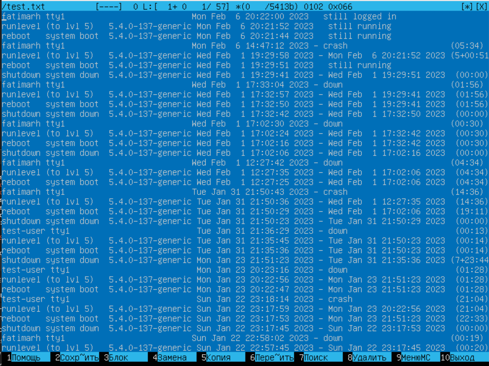
  -  Сначала идет имя пользователя. Обратите внимание, что reboot – это отдельный пользователь, появляющийся во время перезагрузки, shutdown – при выключении, runlevel – при изменении уровня выполнения.
  -  Информация о tty сессии.
  - Имя хоста.
  -  Время входа.
  -  Время выхода.
  -  Продолжительность сессии.

    В данном случае мы видим:
  -  время последне успешной авторизации -> Mon Feb 6 20:22:00 2023;
  -  имя пользователя -> fatimarh;
  -  метод входа в систему -> tty1.

- Прежде чем идти дальше, мы посмотрим, что такое __TTY__.
Как упоминалось в ответе на форуме AskUbuntu, слово TTY появилось из TeleTYpewriter.
Еще в ранние дни Unix пользовательские терминалы, подключенные к компьютерам, были электромеханическими телепринтерами или телетайпами (tty вкратце).
С тех пор имя TTY продолжает использоваться для консолей с текстом. В настоящее время все текстовые консоли представляют собой виртуальные консоли, а не физические консоли. Команда TTY печатает имя файла терминала, подключенного к стандартному входу.
Переключение между TTY в Linux
По умолчанию в Linux есть 7 tty.
Они известны как tty1, tty2 … .. tty7.
От 1 до 6 tty – только командная строка.
7th tty – графический интерфейс (ваш рабочий стол X).
Вы можете переключаться между различными TTY, используя клавиши CTRL + ALT + Fn, для MAC OS option + стрелка влево/вправо.
- __Перезапустить службу SSHd.__
  - Команда __systemctl__ довольно хорошо известна среди пользователей Linux, когда речь идет о включении, отключении, остановке и запуске любой службы. Итак, мы сначала использовали команду systemctl, чтобы включить сервер ssh. Ключевым здесь является слово «enable», наряду с ключевым словом «ssh». Он включит ssh-сервер, синхронизировав скрипт sysv. 
  Ввожу команду:
` sudo systemctl enable ssh`

  - Теперь сервер __ssh__ включен и готов к запуску. Таким образом, команда systemctl будет использоваться еще раз для запуска службы ssh. После запуска службы ssh мы должны проверить, правильно ли она активна и работает. Для этого снова использовался тот же systemctl. В обеих командах есть разница только в одном слове, `start и status`. Вывод показывает, что служба Openssh в настоящее время активна и работает правильно.
  Ввожу команды:
`sudo systemctl start ssh`
`sudo systemctl status ssh`
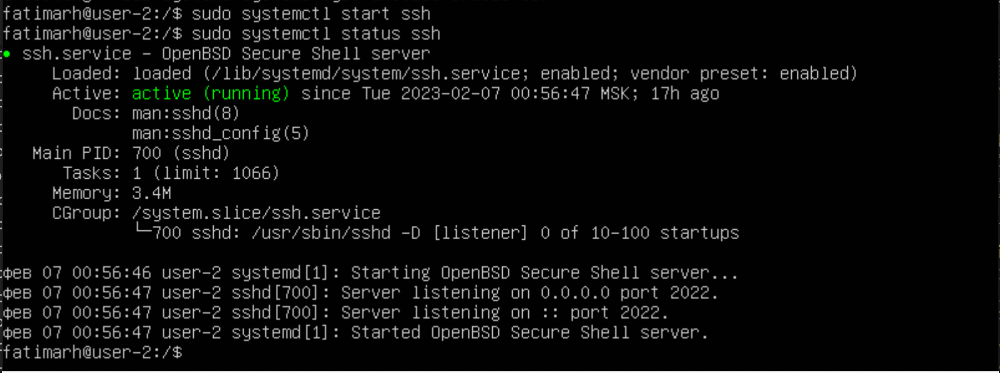
  - Чтобы проверить статус службы ssh, вы также можете использовать ключевое слово sshd вместо ssh.
  Ввожу команду:
`sudo systemctl status sshd`
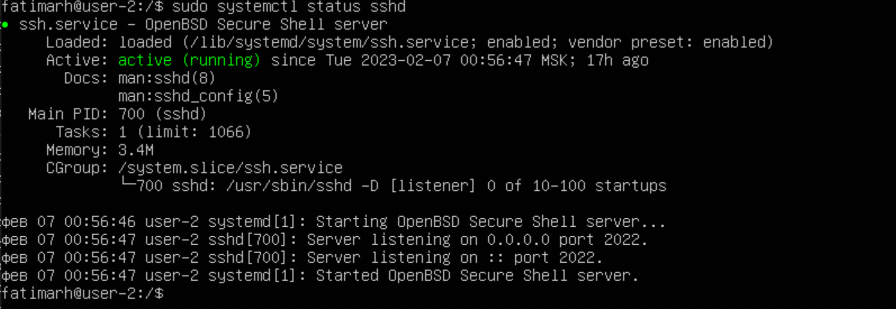
- __Вставить в отчёт скрин с сообщением о рестарте службы (искать в логах)__
   Рестарт слуюбы можно найти в логах по адресу `/var/log/auth.log` .
    Для легкой читаемости ввожу команды:
`sudo -s`
`tail -f /var/log/auth.log`
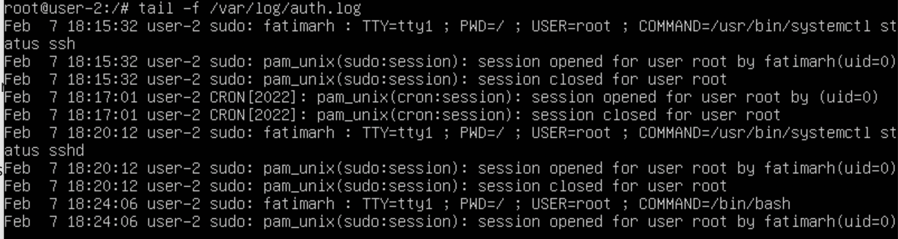
-----
## Part 15. Использование планировщика заданий CRON
- __Используя планировщик заданий, запустите команду uptime через каждые 2 минуты.__
  - CRON уже установлен в моей системе по этому перехожу сразу к настройки.
  В случае отсутсвия __CRON__ используются команды
  `sudo apt install cron`
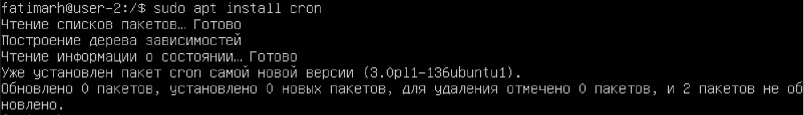
Для запуска __cron__ в фоновом режиме использую команду:
`sudo systemctl enable cron`
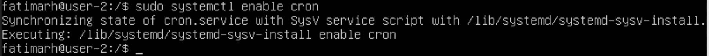
- Системным администраторам, да и обычным пользователям часто приходится автоматизировать различные задачи по обслуживанию и работе с Linux с помощью скриптов. Это очень удобно, вы просто запускаете скрипт, и он делает все что необходимо без вашего вмешательства. Следующий шаг в этом пути - настроить автоматически запуск нужного скрипта в нужное время.

  Именно для этих задач в Linux используется системный сервис cron. Это планировщик, который позволяет выполнять нужные вам скрипты раз в час, раз в день, неделю или месяц, а также в любое заданное вами время или через любой интервал. Программа часто используется даже другими службами операционной системы.

  Фактически, __Cron__ - это сервис, как и большинство других сервисов Linux, он запускается при старте системы и работает в фоновом режиме. Его основная задача выполнять нужные процессы в нужное время. Существует несколько конфигурационных файлов, из которых он берет информацию о том что и когда нужно выполнять. Сервис открывает файл `/etc/crontab`, в котором указаны все нужные данные. Часто, в современных дистрибутивах там прописан запуск утилиты __run-parts__, которая запускает нужные скрипты из следующих папок:
```
/etc/cron.minutely - каждую минуту;
/etc/cron.hourly - каждый час;
/etc/cron.daily - каждый день;
/etc/cron.weekly - каждую неделю;
/etc/cron.monthly - каждый месяц.
```
  - В этих папках должны находиться скрипты, которые нужно выполнять с указанным интервалом. Скрипты должны иметь права на выполнение и их имя не должно содержать точки. Это очень сильно облегчает работу с планировщиком для новых пользователей. Также в файле __crontab__ прописан запуск команды __anacron__, которая работает так же как и cron, только предназначена для задач, которые нужно выполнять раз в длительный период, например, раз в день, неделю, месяц, год.

    Она позволяет выполнять их даже если компьютер работает не всегда и время от времени выключается. Дата выполнения задания последний раз записывается в файл `/var/spool/anacron`, а затем, при следующем запуске __anacron__ проверяет был ли запущен нужный процесс в нужное время, и если нет, то запускает его. Сам же сервис cron больше рассчитан на выполнение задач в течение дня или с точно расписанным временем и датой.
- __Настройка cron__.
Для настройки времени, даты и интервала когда нужно выполнять задание используется специальный синтаксис файла cron и специальная команда. Конечно, вы всегда можете отредактировать файл `/etc/crontab`, но этого делать не рекомендуется. Вместо этого, есть команда __crontab__:
`sudo crontab -e`
При выполнении команды будет дан выбор текстого редактора дял внесения изменений. Я воспользовался __mcedit__. __crontab__ открывает временный файл, в котором уже представлены все текущие правила cron и вы можете добавить новые. После завершения работы команды cron файл будет обработан и все правила будут добавлены в `/var/spool/cron/crontabs/имя_пользователя` причем добавленные процессы будут запускаться именно от того пользователя, от которого вы их добавляли.

  Поэтому тут нужно быть аккуратным, и если вам нужно выполнять скрипты от рута, то и crontab нужно выполнить от рута, а не от пользователя. Это часто становится причиной проблем.
  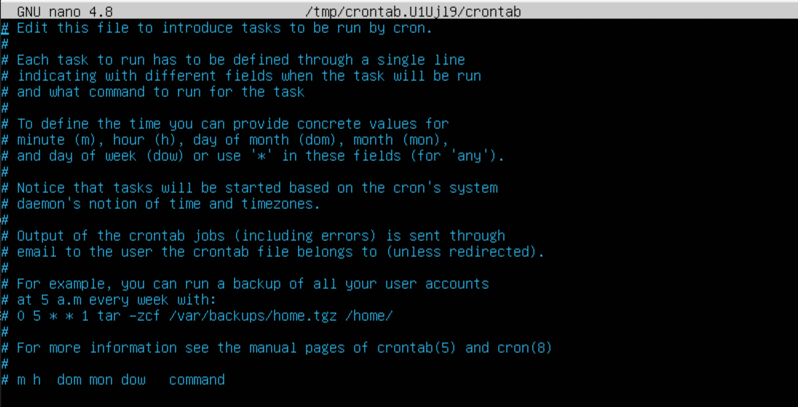
- Синтаксис __crontab__.
Как я уже говорил, время задается особым синтаксисом, давайте рассмотрим синтаксис настройки одной задачи cron:
`минута час день месяц день_недели /путь/к/исполняемому/файлу`
Нужно сказать, что обязательно нужно писать полный путь к команде, потому что для команд, запускаемых от имени cron переменная среды __PATH__ будет отличаться, и сервис просто не сможет найти вашу команду. Это вторая самая распространенная причина проблем с Cron. Дата и время указываются с помощью цифр или символа __'*'__. Этот символ означает, что нужно выполнять каждый раз, если в первом поле - то каждую минуту и так далее.
Вы можете захотеть не указывать отдельно время, а просто указать интервал, с которым нужно запускать скрипт, например, раз в 10 минут. Для этого используется разделитель косая черта - __"/"__:
`*/10 * * * * /usr/local/bin/serve`
Для формирования отчёта данные по работе команды __uptime__ буду записывать в файл:
__cron.txt__
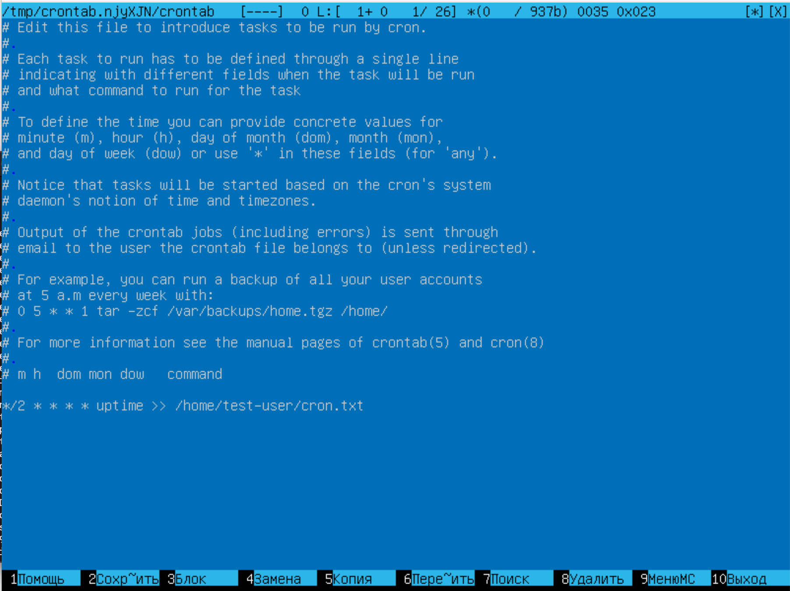

- __uptime.__
Синтаксис для команды uptime следующий:
`uptime [OPTIONS]`
Чтобы отобразить время работы системы, вызовите команду без каких-либо опций:
`uptime`
Вывод будет выглядеть примерно так:
19:59:20 up 1:05, 1 user, load average: 0.00, 0.00, 0.00
- 19:59:20 — текущее системное время.
- up 1:05 — это время, в течение которого система работала.
* 1 user количество зарегистрированных пользователей.
* load average: 0.00, 0.00, 0.00 — средние значения загрузки системы за последние 1, 5 и 15 минут.

  Средняя нагрузка на Linux может немного сбивать с толку. В отличие от других операционных систем, которые показывают средние значения загрузки процессора, Linux показывает средние значения загрузки системы.
Средняя загрузка системы измеряет количество заданий, которые в данный момент выполняются или ожидают дискового ввода-вывода. В основном это говорит о том, насколько занята ваша система в течение заданного интервала.
Если средние значения нагрузки равны 0,0, то система в основном простаивает. Если среднее значение нагрузки за последние 1 минуту выше, чем среднее значение за 5 или 15 минут, то нагрузка увеличивается, в противном случае нагрузка уменьшается. Средняя нагрузка увеличивается из-за более высокой загрузки процессора, нагрузки на диск.
Открываем через некоторое время наш файл __cron.txt__ и видим результат работы команды с интервалом в две минуты.

- Теперь в системном журнале проверим наличие записей о работе вызовов команды используя следующую команду с перенапрвлением данных в файл __cron_data.txt__
  Для этого использую команды:
  `sudo -s`
`sudo grep CRON /var/log/syslog > cron_data.txt`
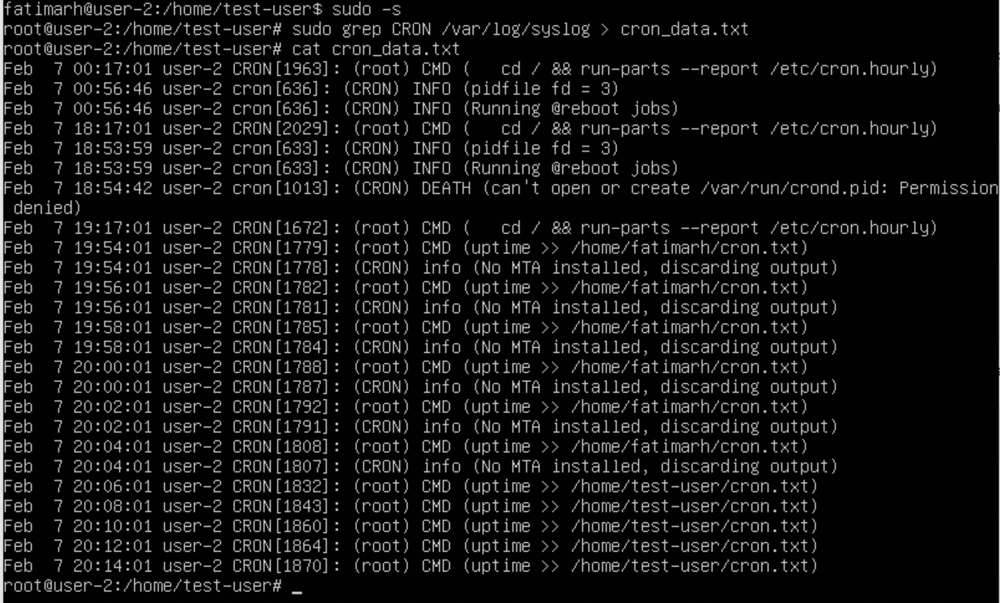
- Удаляю все задания в планировщике заданий:
`sudo cronetab -e`
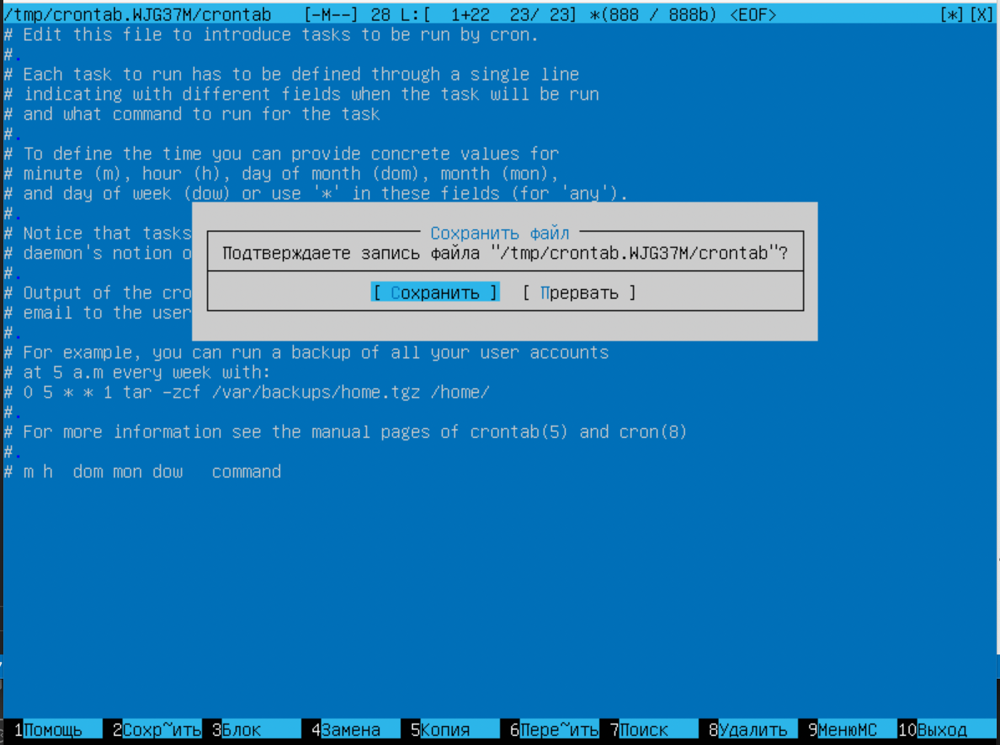
